

# 大人的自媒體：OnlyFans 實戰課
### Adult Creator Economy · OnlyFans Masterclass

**全球前 0.01% 創作者 bunnybrownie 親授・像素動畫互動課程**

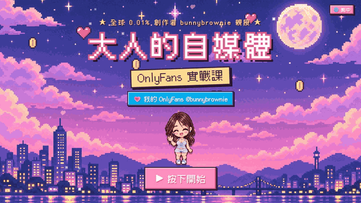

**💗 My OnlyFans (18+)：[onlyfans.com/bunnybrownie](https://onlyfans.com/bunnybrownie)**

> 🔞 **18+ only.** 本課程討論成人內容創作者的經營方法，不含露骨內容，但僅供成年人觀看。This course is about running an adult-content creator business. It contains no explicit material, but it is intended for adults only.

---

## 💌 為什麼做這堂課 · Why I made this

**繁體中文**　嗨，我是 **bunnybrownie**，一路從零做到 OnlyFans 全球前 0.01%。我被封過十個帳號、金流卡關、拍了很多賣不出去的內容——後來才發現，大部分人不是不夠努力，而是**沒有一套系統**。所以我把自己真正在用的方法做成這堂課，希望你少走一點彎路，安全、長久地經營自己。想看看這套系統實際跑起來的樣子？歡迎來我的 [OnlyFans](https://onlyfans.com/bunnybrownie) 找我（限 18 歲以上）。

**简体中文**　嗨，我是 **bunnybrownie**，一路从零做到 OnlyFans 全球前 0.01%。我被封过十个账号、收款卡关、拍了很多卖不出去的内容——后来才发现，大部分人不是不够努力，而是**没有一套系统**。所以我把自己真正在用的方法做成这门课，希望你少走一点弯路，安全、长久地经营自己。想看这套系统实际运作的样子？欢迎来我的 [OnlyFans](https://onlyfans.com/bunnybrownie) 找我（仅限 18 岁以上）。

**English**　Hi, I'm **bunnybrownie** — I went from zero to the global top 0.01% of OnlyFans creators. Ten banned accounts, payout headaches, and plenty of content that never sold taught me that most creators don't lack effort — they lack a **system**. So I turned the exact system I use into this course, to save you some detours and help you build something safe and sustainable. Want to see it in action? Come find me on [OnlyFans](https://onlyfans.com/bunnybrownie) (18+ only).

---

## 🎬 搶先看 · Take a look

<table>
<tr>
<td width="50%" valign="top">
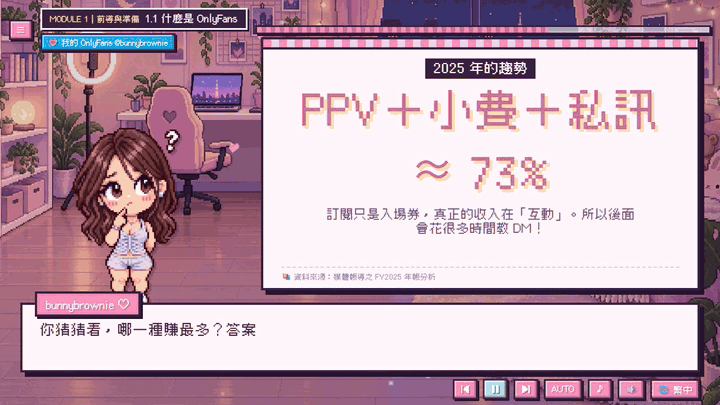
 <b>像素講師＋白板動畫</b> 我的聲音導讀、字幕打字機效果，白板重點逐項出現。 Pixel host, voice narration, animated whiteboards.
</td>
<td width="50%" valign="top">
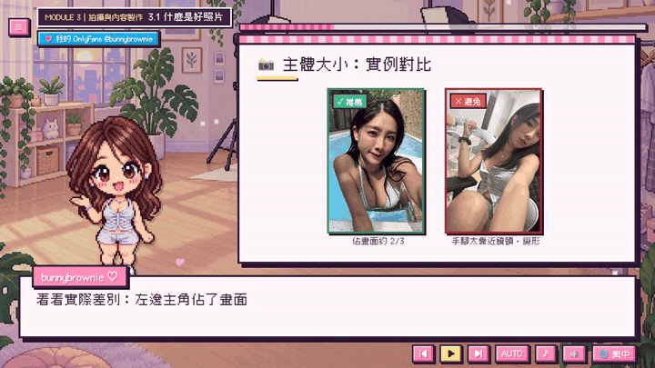
 <b>實拍範例照片</b> 光線、構圖、主體大小、機位——好壞對比一看就懂。 Do / don't photo examples for lighting, framing and angles.
</td>
</tr>
<tr>
<td width="50%" valign="top">
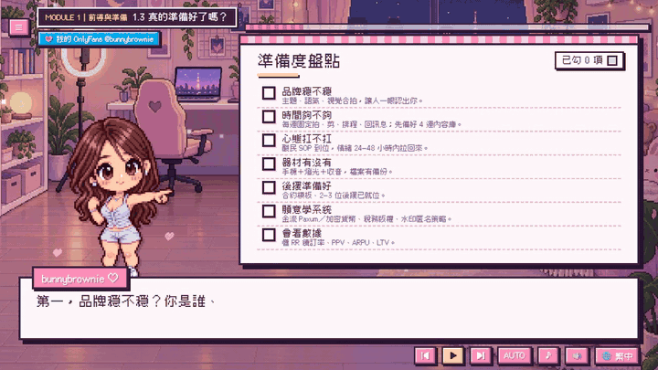
 <b>互動 Checklist</b> 邊上課邊勾選，自動亮紅／黃／綠燈，進度會記住。 Interactive self-assessment with a traffic-light score.
</td>
<td width="50%" valign="top">
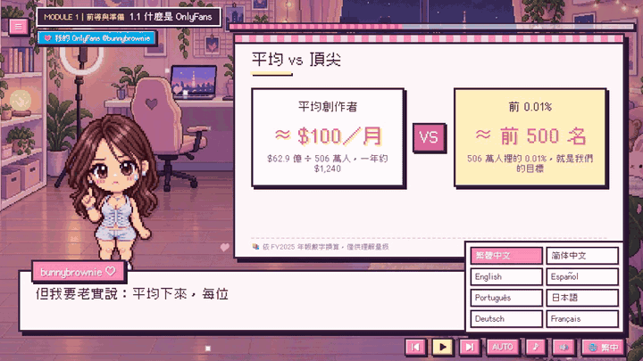
 <b>8 種語言一鍵切換</b> 繁中・简中・English・Español・Português・日本語・Deutsch・Français。 Switch languages anytime — the lesson keeps its place.
</td>
</tr>
</table>

---

## 🗺️ 課程地圖 · Course map

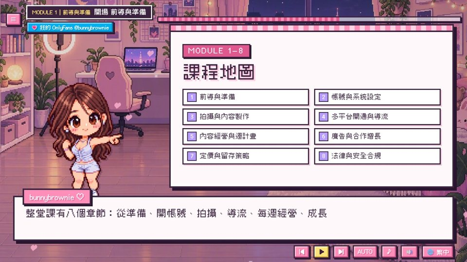

| # | 章節 | Module | 你會學到 · You'll learn |
|:-:|---|---|---|
| 1 | 前導與準備 | Getting ready | 平台商業模式、最新財報數據、適不適合你的 5 大檢查點、ARPU／RR／LTV |
| 2 | 帳號與系統設定 | Account & setup | 註冊驗證、後台導覽、金流、Paxum、加密貨幣交易所與加密卡、內容資產管理 |
| 3 | 拍攝與內容製作 | Shooting & content | 光線構圖敘事、付費影片節奏、機位表情情緒、拍攝安全與同意書 |
| 4 | 多平台開通與導流 | Platforms & traffic | 售片平台（含日本馬賽克規定）、流量池、社群、私域、OFTV／YouTube、連結頁、被封怎麼辦 |
| 5 | 內容經營與週計畫 | Weekly operations | 可直接照抄的週計畫、每週清單與數據儀表板 |
| 6 | 廣告與合作增長 | Ads & collabs | GigSocial、SFS 互推、套餐設計、廣告 ROI、SEO |
| 7 | 定價與留存策略 | Pricing & retention | 價值階梯、加售時機、DM 三段劇本、驚喜機制、續訂率與 LTV |
| 8 | 法律與安全合規 | Law & safety | 內容紅線、版權稅務、各國法規、外流求助（StopNCII）、自身安全 Final Check |

<table>
<tr>
<td>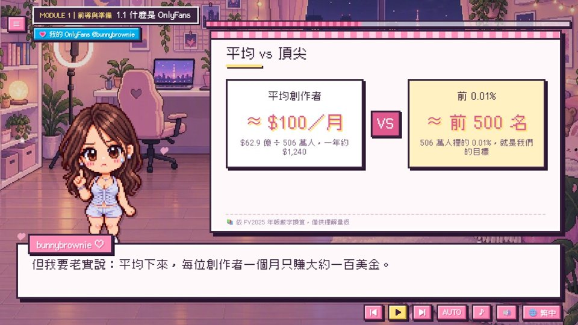</td>
<td>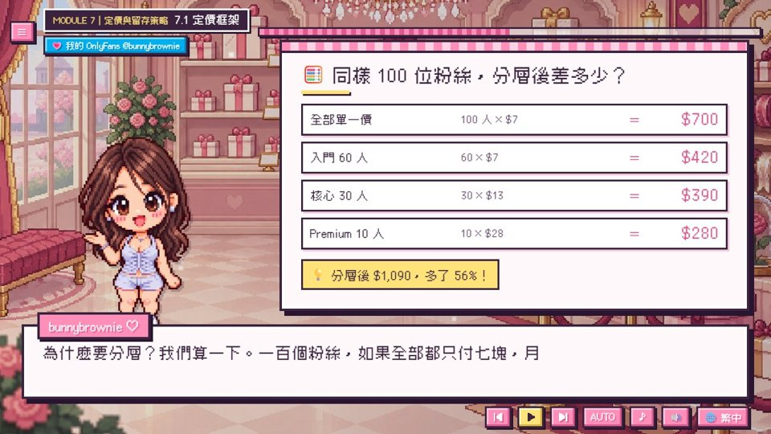</td>
<td>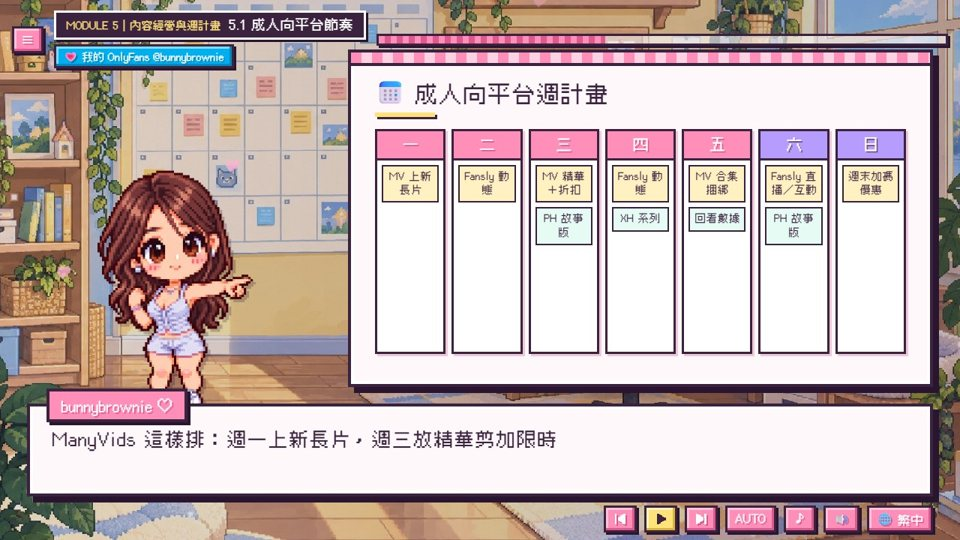</td>
</tr>
<tr>
<td align="center">真實數據（附資料來源）</td>
<td align="center">分層定價：同樣 100 人多賺 56%</td>
<td align="center">可照抄的週計畫</td>
</tr>
<tr>
<td>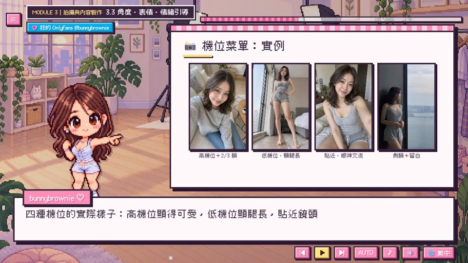</td>
<td>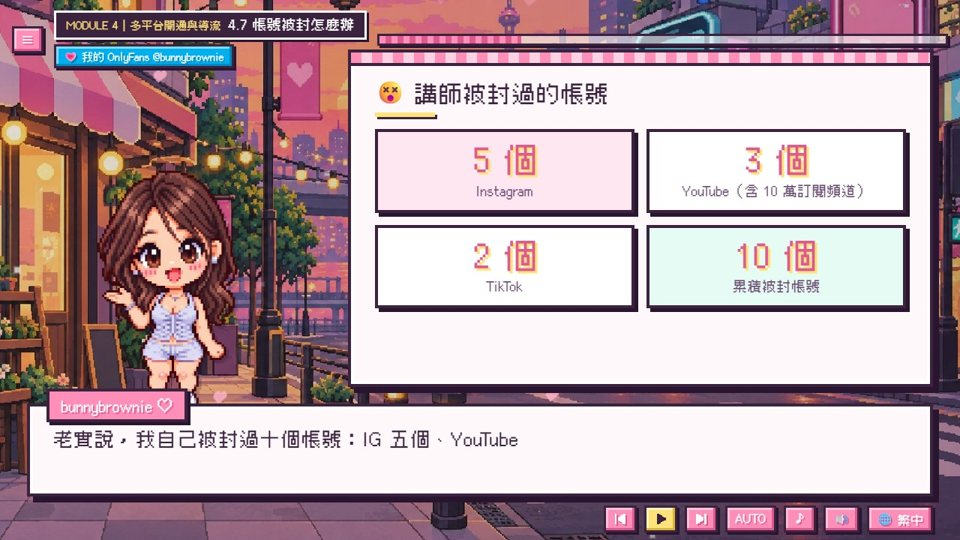</td>
<td>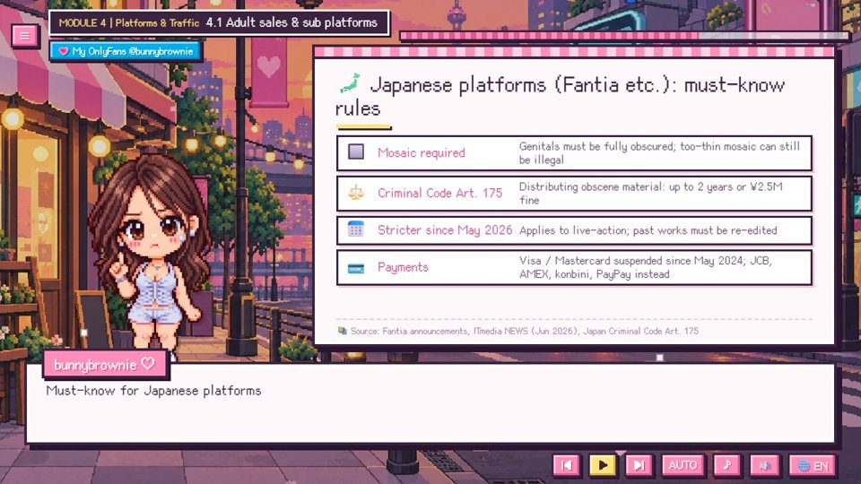</td>
</tr>
<tr>
<td align="center">機位菜單實拍範例</td>
<td align="center">我被封過的 10 個帳號與心態</td>
<td align="center">Japan: mosaic rules (EN)</td>
</tr>
</table>

---

## 🌏 8 種語言 · 8 languages

| 語言 | 字幕 Subtitles | 語音 Voice |
|---|:-:|:-:|
| 繁體中文（含台灣專屬內容：英文戶籍謄本、MAX、台灣法規） | ✅ | 中文 |
| 简体中文 | ✅ | 中文 |
| English | ✅ | English |
| Español · Português · 日本語 · Deutsch · Français | ✅ | English |

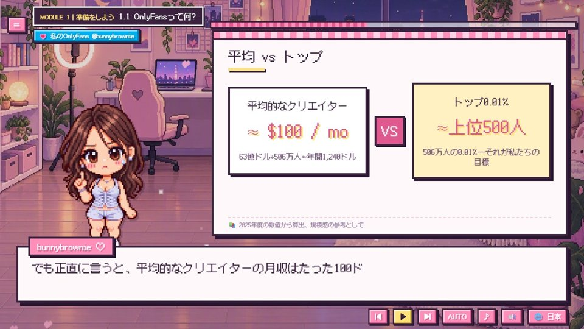

---

## 🔞 年齡確認 · Age gate

課程首頁與每一節左上角都有我的 OnlyFans 連結；點擊後會先確認已滿 18 歲，才會開新視窗前往。
The OnlyFans link on every screen asks visitors to confirm they are 18+ before opening.

---

## ▶️ 怎麼觀看 · How to watch

- **線上 Online：** <https://bunnybrownie36.github.io/bunnybrownie-of-course/>
- **離線 Offline：** 下載後直接用瀏覽器打開 `course/index.html`
- 鍵盤：`空白鍵` 播放／暫停、`←` `→` 上一句／下一句

### Notes
- 課程內容為一般教育用途，**不構成法律、稅務或投資建議**；平台規則常變動，請以最新條款為準。Not legal, tax, or financial advice.
- 語音 Fish Audio · 音樂 Google Lyria 3.5 · 插畫 GPT Image 2.5 · 字型 [Cubic 11](https://github.com/ACh-K/Cubic-11)、[Fusion Pixel Font](https://github.com/TakWolf/fusion-pixel-font)（SIL OFL 1.1）

**💗 [onlyfans.com/bunnybrownie](https://onlyfans.com/bunnybrownie)**（18+）

