

# Adult Creator Economy · OnlyFans Masterclass

**A free, pixel-art interactive course by bunnybrownie, a global top 0.01% OnlyFans creator**

**English** | [繁體中文](docs/zh-Hant/README.md) | [简体中文](docs/zh-Hans/README.md) | [Español](docs/es/README.md) | [Português](docs/pt/README.md) | [日本語](docs/ja/README.md) | [Deutsch](docs/de/README.md) | [Français](docs/fr/README.md)

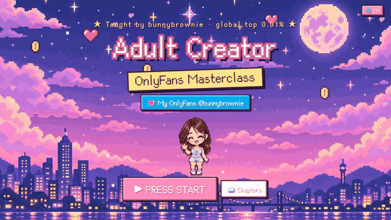

**▶ [Start the free course](https://bunnybrownie36.github.io/bunnybrownie-of-course/)** · 💗 my page (18+) is linked inside the course

> 🔞 **Adults (18+) only.** This course is about running an adult-content creator business. It includes suggestive example photos of me, and visitors confirm their age before entering. It contains no explicit material.

---

## 💌 Why I made this

Hi, I'm **bunnybrownie**. I went from zero to the global top 0.01% of OnlyFans creators. Along the way I lost ten social media accounts to bans, got stuck on payouts, and shot plenty of content that never sold. What I learned is that most creators don't lack effort — they lack a **system**.

So I turned the exact system I use into this course, and made it free. I hope it saves you some detours and helps you build something safe and sustainable. Want to see the system in action? You'll find a link to my page inside the course (18+ only).

---

## 🎬 Take a look

<table>
<tr>
<td width="50%" valign="top">
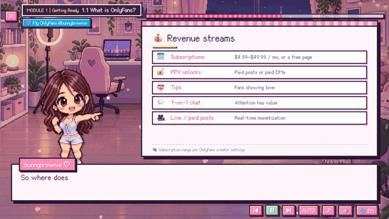
 <b>Pixel host + animated whiteboards</b> Voice narration, typewriter subtitles, and key points that appear one by one.
</td>
<td width="50%" valign="top">
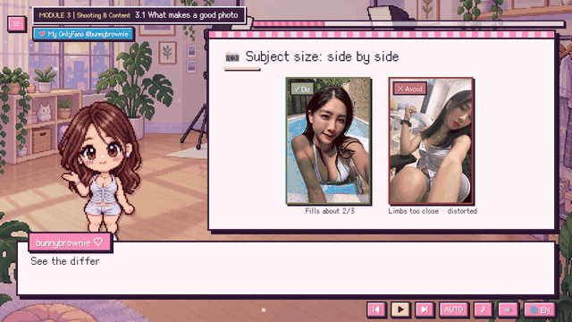
 <b>Real photo examples</b> Light, framing, subject size and camera angles — do / don't side by side, shot by me.
</td>
</tr>
<tr>
<td width="50%" valign="top">
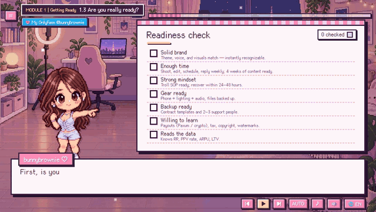
 <b>Interactive checklists</b> Tick items as you go and get a red / yellow / green readiness score. Your answers are saved.
</td>
<td width="50%" valign="top">
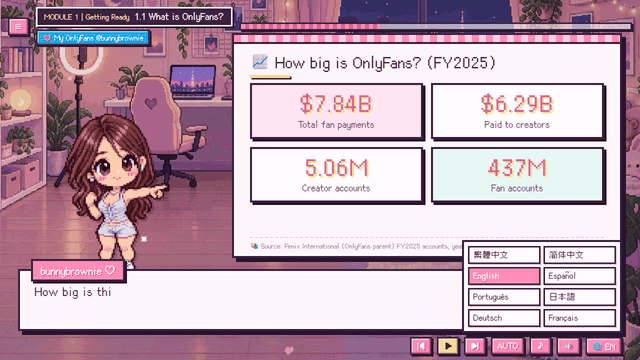
 <b>8 languages, one click</b> Switch languages at any time — the lesson keeps its place.
</td>
</tr>
</table>

---

## 🗺️ Course map

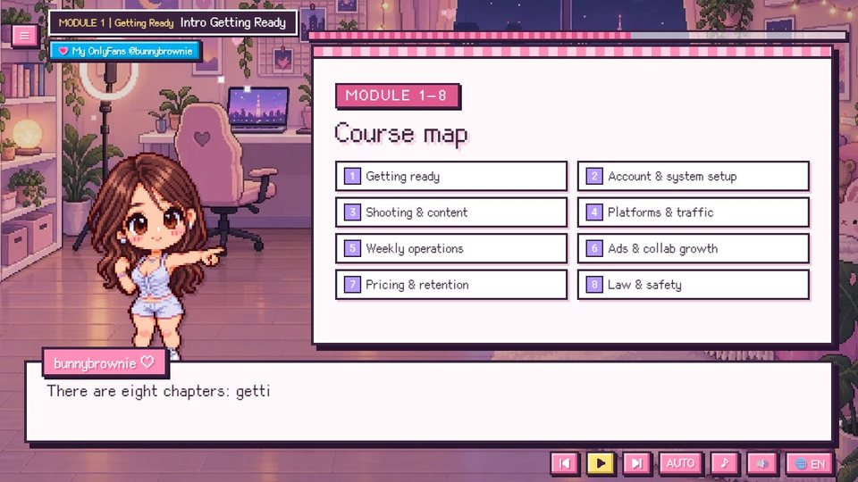

| # | Module | What you'll learn |
|:-:|---|---|
| 1 | **Getting Ready** | Know if this path fits you and what you need before you start |
| 2 | **Account & System Setup** | A working account and payouts, plus your base data and workflow |
| 3 | **Shooting & Content** | Create content that converts, and shoot safely and legally |
| 4 | **Platforms & Traffic** | Build an outside traffic network to boost reach and conversion |
| 5 | **Weekly Operations** | Run on a weekly rhythm and keep improving content and relationships |
| 6 | **Ads & Collab Growth** | Master paid and free growth channels to acquire fans efficiently |
| 7 | **Pricing & Retention** | Make every fan tier feel it's worth it, and raise LTV and renewals |
| 8 | **Law & Safety** | Operate safely and legally, avoiding high risks and needless losses |

<table>
<tr>
<td>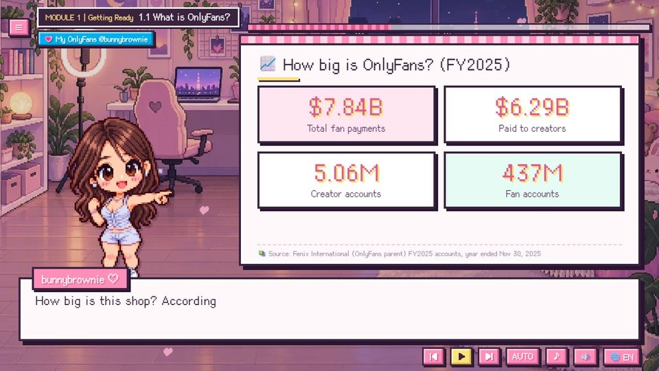</td>
<td>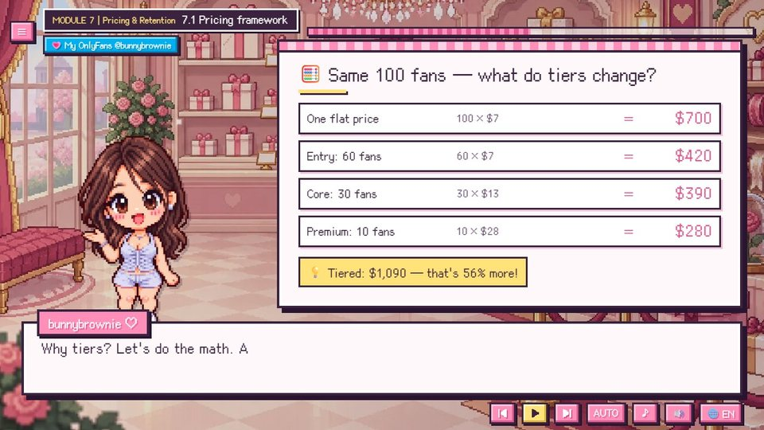</td>
<td>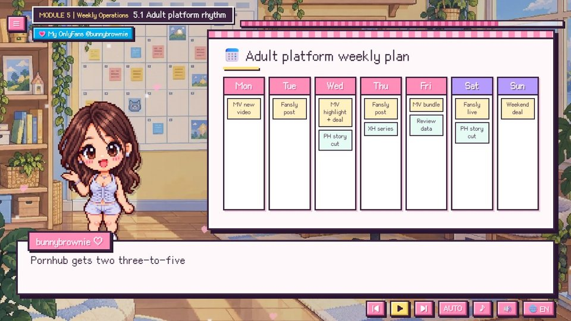</td>
</tr>
<tr>
<td align="center">Real data, with sources</td>
<td align="center">Tiered pricing: same 100 fans, 56% more revenue</td>
<td align="center">A weekly plan you can copy</td>
</tr>
<tr>
<td>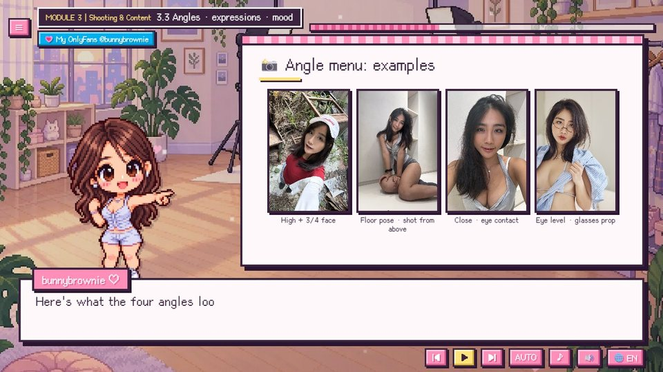</td>
<td>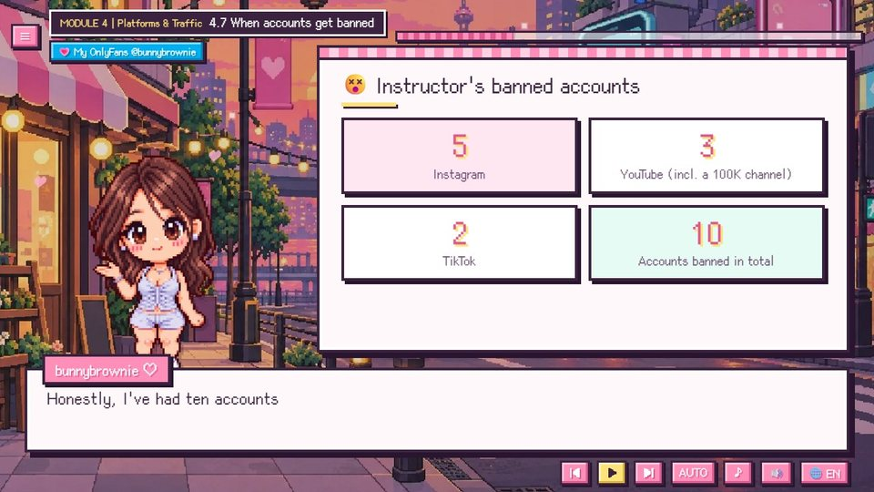</td>
<td>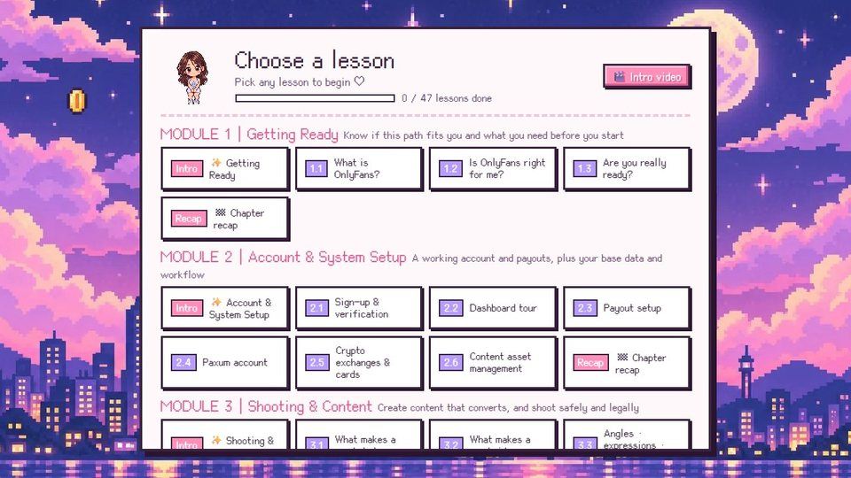</td>
</tr>
<tr>
<td align="center">Camera angle menu with real photos</td>
<td align="center">The 10 accounts I lost — and the right mindset</td>
<td align="center">Chapter menu with your progress</td>
</tr>
</table>

---

## ✨ Features

<table>
<tr>
<td width="62%" valign="top">

- 🎙️ **My real voice** narrates every line (Chinese and English), with emotion — not a robot.
- 🌏 **8 languages**: subtitles and whiteboards fully translated; country-specific content only where it applies.
- 📱 **Phone, tablet and desktop**: a dedicated portrait layout when you hold your phone upright.
- ▶️ **Picks up where you left off**: the title screen offers "Continue" and resumes at the exact line.
- ✅ **Interactive checklists and calculators** that remember your answers.
- 📊 **Real numbers with sources** on every data board.
- ⚡ **Lightweight**: the first visit downloads only about 260 KB.
- 💸 **Free**, no sign-up.

</td>
<td width="38%" valign="top" align="center">
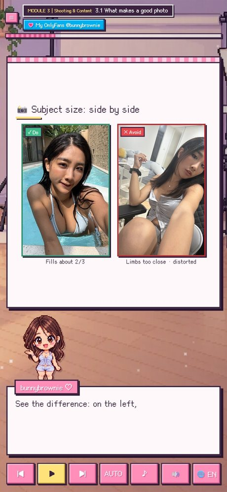
 Portrait layout on a phone
</td>
</tr>
</table>

---

## 🌏 8 languages

| Language | Subtitles | Voice |
|---|:-:|:-:|
| 繁體中文 (with Taiwan-specific lessons: documents, local exchanges, Taiwan law) | ✅ | Chinese |
| 简体中文 | ✅ | Chinese |
| English | ✅ | English |
| Español · Português · 日本語 · Deutsch · Français | ✅ | English |

---

## 🔞 Age check

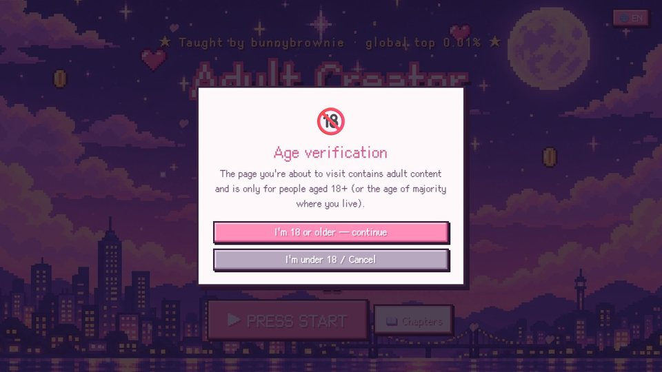

The first time you enter the course, you'll be asked to confirm that you are 18 or older (you're only asked once). The link to my page on every screen asks again before it opens.

---

## ▶️ How to watch

- **Online:** <https://bunnybrownie36.github.io/bunnybrownie-of-course/>
- **📱 Phone / tablet:** open the same link in your mobile browser — hold it upright for the portrait layout, or turn it sideways for widescreen.
- **🎬 Intro video:** a short intro from me is available from the chapter menu.
- **Offline:** download this repository and open `course/index.html` in your browser.
- **Keyboard:** `Space` play / pause, `←` `→` previous / next line.

### Notes
- This course is general education and **not legal, tax or financial advice**. Platform rules change often — always check the latest terms.
- Voice: Fish Audio · Music: Google Lyria 3.5 · Illustrations: GPT Image 2.5 · Example photos: shot by the creator · Fonts: [Cubic 11](https://github.com/ACh-K/Cubic-11), [Fusion Pixel Font](https://github.com/TakWolf/fusion-pixel-font) (SIL OFL 1.1)

**▶ [Start the free course](https://bunnybrownie36.github.io/bunnybrownie-of-course/)**

