

# Adult Creator · OnlyFans-Praxiskurs

**Ein kostenloser, interaktiver Pixel-Art-Kurs von bunnybrownie, einer OnlyFans-Creatorin aus den weltweiten Top 0,01 %**

[English](../../README.md) | [繁體中文](../../docs/zh-Hant/README.md) | [简体中文](../../docs/zh-Hans/README.md) | [Español](../../docs/es/README.md) | [Português](../../docs/pt/README.md) | [日本語](../../docs/ja/README.md) | **Deutsch** | [Français](../../docs/fr/README.md)

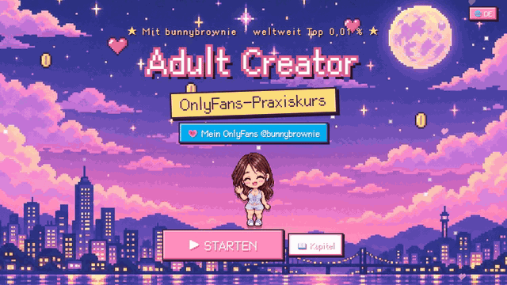

**💗 Mein OnlyFans (18+): [onlyfans.com/bunnybrownie](https://onlyfans.com/bunnybrownie)**

> 🔞 **Nur für Erwachsene (18+).** In diesem Kurs geht es darum, ein Business als Adult-Content-Creatorin aufzubauen. Er enthält anzügliche Beispielfotos von mir, und Besucherinnen und Besucher bestätigen ihr Alter, bevor sie den Kurs betreten. Er enthält kein explizites Material.

---

## 💌 Warum ich das gemacht habe

Hi, ich bin **bunnybrownie**. Ich habe es von null auf die weltweiten Top 0,01 % der OnlyFans-Creator geschafft. Auf dem Weg dorthin habe ich zehn Social-Media-Accounts durch Sperrungen verloren, hing bei Auszahlungen fest und habe eine Menge Content gedreht, der sich nie verkauft hat. Was ich daraus gelernt habe: Den meisten Creatorinnen fehlt es nicht an Einsatz — ihnen fehlt ein **System**.

Also habe ich genau das System, das ich selbst benutze, in diesen Kurs gepackt und ihn kostenlos gemacht. Ich hoffe, er erspart dir ein paar Umwege und hilft dir, dir etwas Sicheres und Nachhaltiges aufzubauen. Willst du das System in Aktion sehen? Komm mich auf [OnlyFans](https://onlyfans.com/bunnybrownie) besuchen (nur 18+).

---

## 🎬 Schau mal rein

<table>
<tr>
<td width="50%" valign="top">
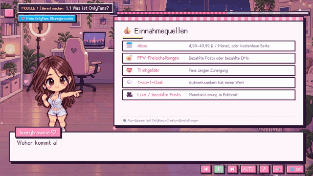
 <b>Pixel-Host + animierte Whiteboards</b> Sprachnarration, Untertitel im Schreibmaschinen-Stil und Kernpunkte, die nacheinander erscheinen.
</td>
<td width="50%" valign="top">
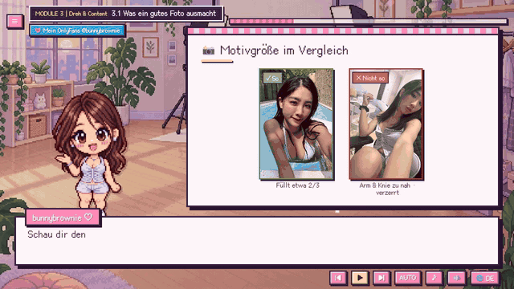
 <b>Echte Fotobeispiele</b> Licht, Bildausschnitt, Motivgröße und Kamerawinkel — Do's und Don'ts im direkten Vergleich, selbst fotografiert.
</td>
</tr>
<tr>
<td width="50%" valign="top">
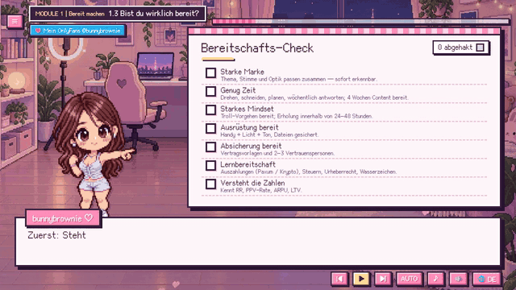
 <b>Interaktive Checklisten</b> Hake Punkte ab und erhalte einen rot/gelb/grünen Readiness-Score. Deine Antworten werden gespeichert.
</td>
<td width="50%" valign="top">

 <b>8 Sprachen, ein Klick</b> Wechsle jederzeit die Sprache — die Lektion bleibt genau an deiner Stelle.
</td>
</tr>
</table>

---

## 🗺️ Kursübersicht

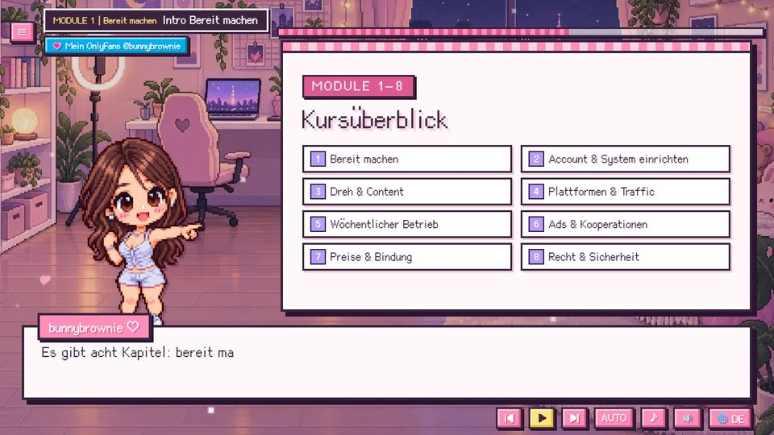

| # | Modul | Was du lernst |
|:-:|---|---|
| 1 | **Bereit machen** | Finde heraus, ob dieser Weg zu dir passt und was du vor dem Start brauchst |
| 2 | **Account & System Setup** | Ein funktionierender Account mit Auszahlungen, plus deine Basisdaten und dein Workflow |
| 3 | **Dreh & Content** | Erstelle Content, der konvertiert, und drehe sicher und rechtlich einwandfrei |
| 4 | **Plattformen & Traffic** | Baue ein externes Traffic-Netzwerk auf, um Reichweite und Konversion zu steigern |
| 5 | **Weekly Operations** | Run on a weekly rhythm and keep improving content and relationships |
| 6 | **Ads & Kollab-Wachstum** | Meistere bezahlte und kostenlose Wachstumskanäle, um effizient Fans zu gewinnen |
| 7 | **Preisgestaltung & Bindung** | Sorg dafür, dass sich jede Fan-Stufe lohnt, und steigere LTV und Verlängerungen |
| 8 | **Recht & Sicherheit** | Sicher und legal arbeiten, hohe Risiken und unnötige Verluste vermeiden |

<table>
<tr>
<td>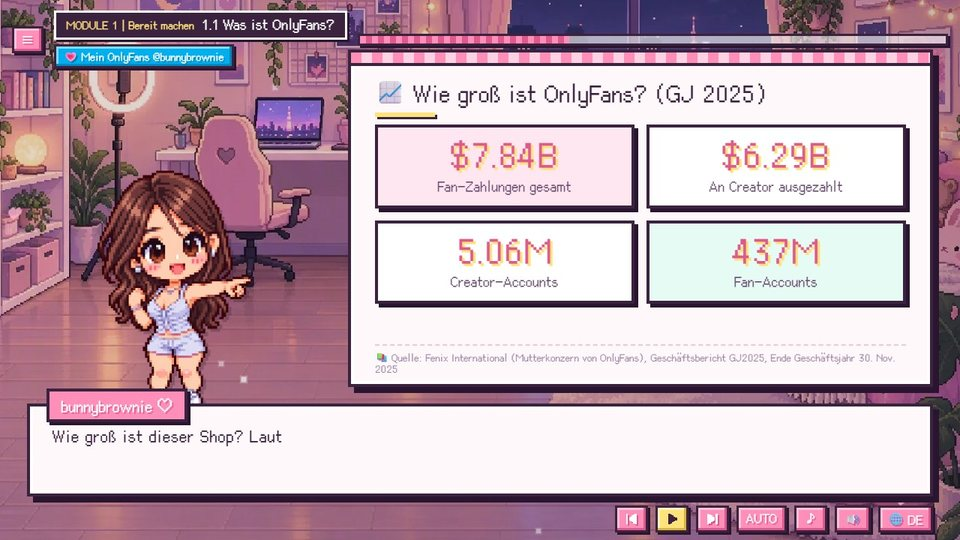</td>
<td>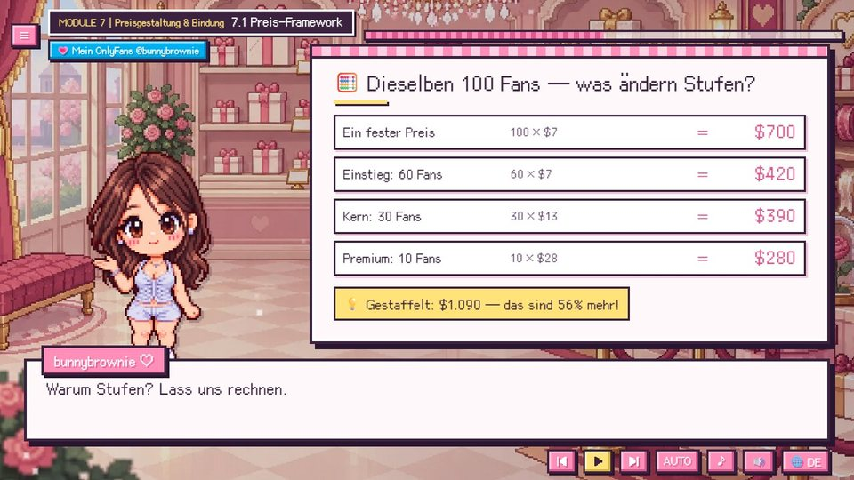</td>
<td>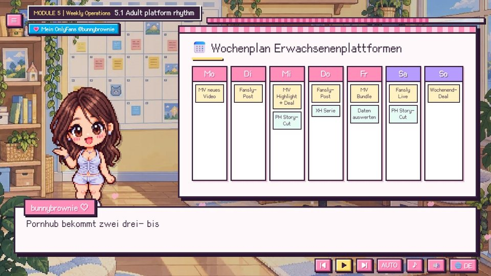</td>
</tr>
<tr>
<td align="center">Echte Daten, mit Quellen</td>
<td align="center">Gestaffelte Preise: dieselben 100 Fans, 56 % mehr Umsatz</td>
<td align="center">Ein Wochenplan zum Nachmachen</td>
</tr>
<tr>
<td>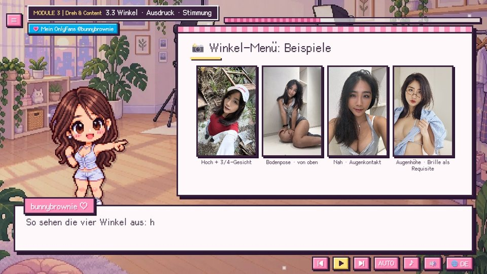</td>
<td>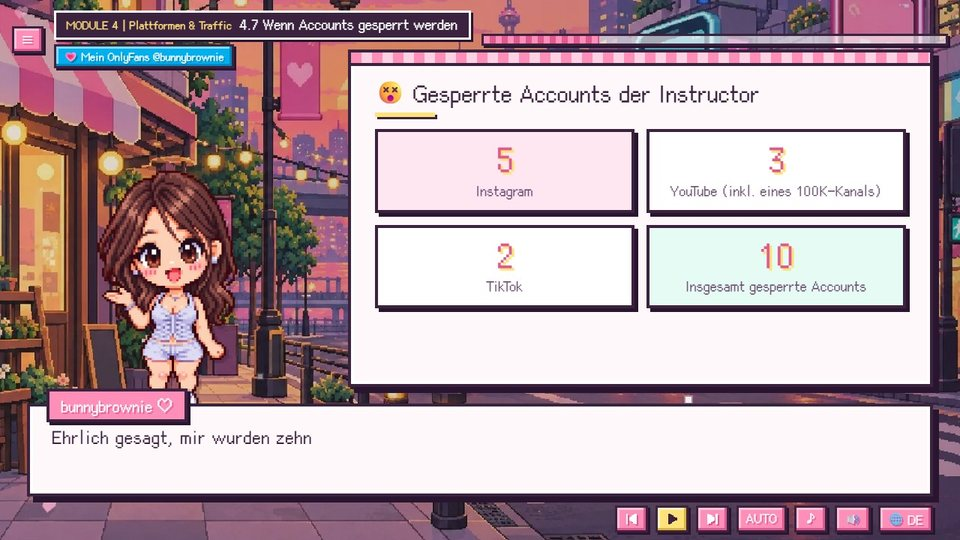</td>
<td>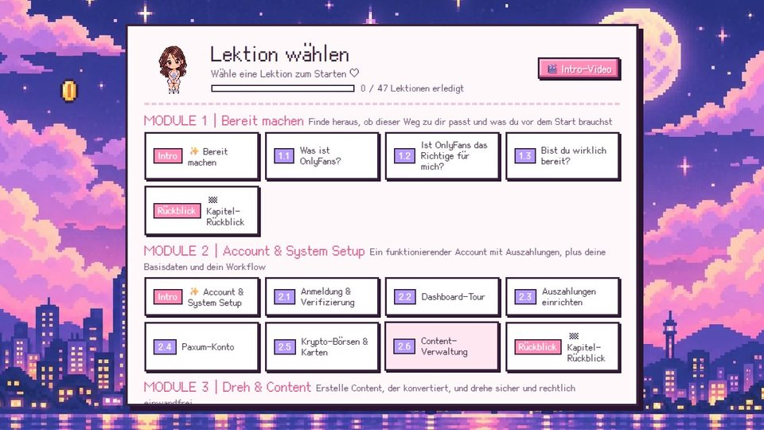</td>
</tr>
<tr>
<td align="center">Menü mit Kamerawinkeln und echten Fotos</td>
<td align="center">Die 10 Accounts, die ich verloren habe — und die richtige Einstellung dazu</td>
<td align="center">Kapitelmenü mit deinem Fortschritt</td>
</tr>
</table>

---

## ✨ Features

<table>
<tr>
<td width="62%" valign="top">

- 🎙️ **Meine echte Stimme** erzählt jede Zeile (Chinesisch und Englisch), mit Gefühl — kein Roboter.
- 🌏 **8 Sprachen**: Untertitel und Whiteboards vollständig übersetzt; landesspezifische Inhalte nur dort, wo sie relevant sind.
- 📱 **Handy, Tablet und Desktop**: ein eigenes Hochformat-Layout, wenn du dein Handy aufrecht hältst.
- ▶️ **Macht da weiter, wo du aufgehört hast**: der Titelbildschirm bietet „Fortsetzen" und springt genau zur richtigen Zeile.
- ✅ **Interaktive Checklisten und Rechner**, die sich deine Antworten merken.
- 📊 **Echte Zahlen mit Quellen** auf jedem Datenboard.
- ⚡ **Leichtgewichtig**: beim ersten Besuch werden nur etwa 260 KB geladen.
- 💸 **Kostenlos**, keine Anmeldung nötig.

</td>
<td width="38%" valign="top" align="center">
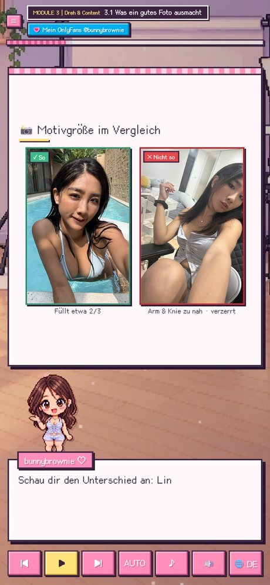
 Hochformat-Layout auf dem Handy
</td>
</tr>
</table>

---

## 🌏 8 Sprachen

| Sprache | Untertitel | Stimme |
|---|:-:|:-:|
| 繁體中文 (mit taiwanspezifischen Lektionen: Dokumente, lokale Börsen, taiwanisches Recht) | ✅ | Chinesisch |
| 简体中文 | ✅ | Chinesisch |
| English | ✅ | Englisch |
| Español · Português · 日本語 · Deutsch · Français | ✅ | Englisch |

---

## 🔞 Altersprüfung

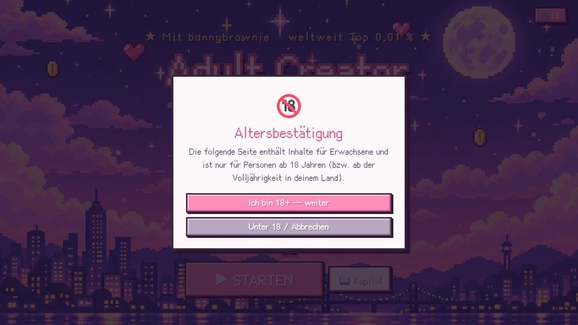

Beim ersten Betreten des Kurses wirst du gebeten zu bestätigen, dass du 18 Jahre oder älter bist (das wird nur einmal gefragt). Der OnlyFans-Link auf jedem Bildschirm fragt noch einmal nach, bevor er sich öffnet.

---

## ▶️ So schaust du den Kurs

- **Online:** <https://bunnybrownie36.github.io/bunnybrownie-of-course/>
- **📱 Handy / Tablet:** öffne denselben Link in deinem mobilen Browser — halte es aufrecht für das Hochformat-Layout oder dreh es seitlich für die Breitbildansicht.
- **🎬 Intro-Video:** ein kurzes Intro von mir findest du im Kapitelmenü.
- **Offline:** lade dieses Repository herunter und öffne `course/index.html` in deinem Browser.
- **Tastatur:** `Leertaste` Abspielen/Pause, `←` `→` vorherige/nächste Zeile.

### Hinweise
- Dieser Kurs dient der allgemeinen Bildung und ist **keine Rechts-, Steuer- oder Finanzberatung**. Plattformregeln ändern sich häufig — prüfe immer die aktuellen Nutzungsbedingungen.
- Stimme: Fish Audio · Musik: Google Lyria 3.5 · Illustrationen: GPT Image 2.5 · Beispielfotos: fotografiert von der Creatorin · Schriften: [Cubic 11](https://github.com/ACh-K/Cubic-11), [Fusion Pixel Font](https://github.com/TakWolf/fusion-pixel-font) (SIL OFL 1.1)

**💗 [onlyfans.com/bunnybrownie](https://onlyfans.com/bunnybrownie)** (18+)

