

# Creadora Adulta · Curso práctico de OnlyFans

**Un curso interactivo gratuito en pixel art, creado por bunnybrownie, una creadora de OnlyFans del top global 0.01%**

[English](../../README.md) | [繁體中文](../../docs/zh-Hant/README.md) | [简体中文](../../docs/zh-Hans/README.md) | **Español** | [Português](../../docs/pt/README.md) | [日本語](../../docs/ja/README.md) | [Deutsch](../../docs/de/README.md) | [Français](../../docs/fr/README.md)

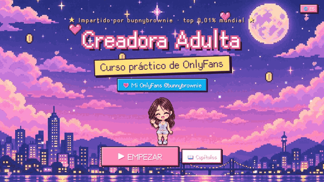

**💗 Mi OnlyFans (18+): [onlyfans.com/bunnybrownie](https://onlyfans.com/bunnybrownie)**

> 🔞 **Solo para adultos (18+).** Este curso trata sobre cómo llevar un negocio de creación de contenido para adultos. Incluye fotos de ejemplo sugerentes mías, y las personas visitantes confirman su edad antes de entrar. No contiene material explícito.

---

## 💌 Por qué hice esto

Hola, soy **bunnybrownie**. Pasé de cero al top global 0.01% de creadoras de OnlyFans. En el camino perdí diez cuentas de redes sociales por bloqueos, me quedé atascada con los pagos, y grabé muchísimo contenido que nunca se vendió. Lo que aprendí es que a la mayoría de las creadoras no les falta esfuerzo, les falta un **sistema**.

Así que convertí el sistema exacto que uso en este curso, y lo hice gratuito. Espero que te ahorre algunos desvíos y te ayude a construir algo seguro y sostenible. ¿Quieres ver el sistema en acción? Ven a buscarme en [OnlyFans](https://onlyfans.com/bunnybrownie) (solo 18+).

---

## 🎬 Échale un vistazo

<table>
<tr>
<td width="50%" valign="top">
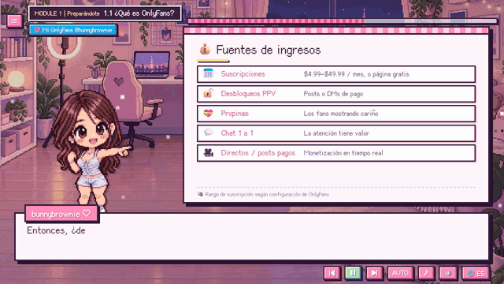
 <b>Anfitriona pixelada + pizarras animadas</b> Narración de voz, subtítulos tipo máquina de escribir, y puntos clave que aparecen uno por uno.
</td>
<td width="50%" valign="top">
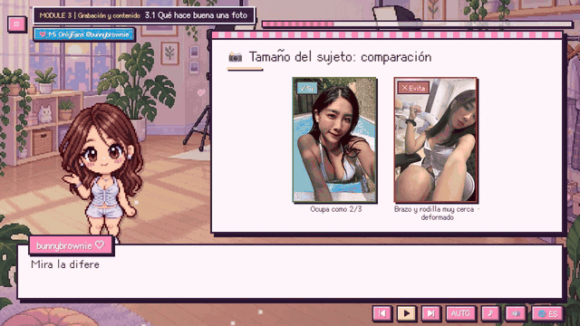
 <b>Ejemplos de fotos reales</b> Luz, encuadre, tamaño del sujeto y ángulos de cámara — comparaciones de qué hacer y qué no, tomadas por mí.
</td>
</tr>
<tr>
<td width="50%" valign="top">
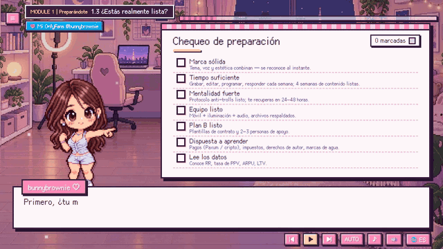
 <b>Listas de verificación interactivas</b> Marca los elementos a medida que avanzas y obtén una puntuación de preparación en rojo, amarillo o verde. Tus respuestas se guardan.
</td>
<td width="50%" valign="top">

 <b>8 idiomas, un solo clic</b> Cambia de idioma en cualquier momento — la lección mantiene su lugar.
</td>
</tr>
</table>

---

## 🗺️ Mapa del curso

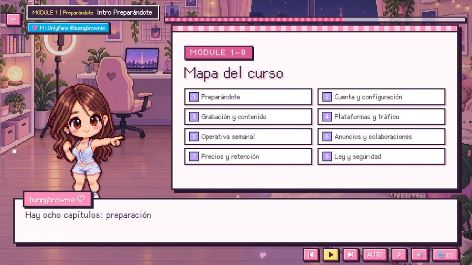

| # | Módulo | Lo que aprenderás |
|:-:|---|---|
| 1 | **Preparándote** | Descubre si este camino es para ti y qué necesitas antes de empezar |
| 2 | **Configuración de cuenta y sistema** | Una cuenta funcionando y cobros activos, además de tu base de datos y flujo de trabajo |
| 3 | **Grabación y contenido** | Crea contenido que convierta, y graba de forma segura y legal |
| 4 | **Plataformas y tráfico** | Construye una red de tráfico externa para aumentar el alcance y la conversión |
| 5 | **Operaciones semanales** | Mantén un ritmo semanal y sigue mejorando tu contenido y tus relaciones |
| 6 | **Anuncios y crecimiento con colaboraciones** | Domina los canales de crecimiento pagados y gratuitos para conseguir fans de forma eficiente |
| 7 | **Precios y retención** | Haz que cada nivel de fan sienta que vale la pena, y aumenta el LTV y las renovaciones |
| 8 | **Ley y seguridad** | Opera de forma segura y legal, evitando riesgos altos y pérdidas innecesarias |

<table>
<tr>
<td>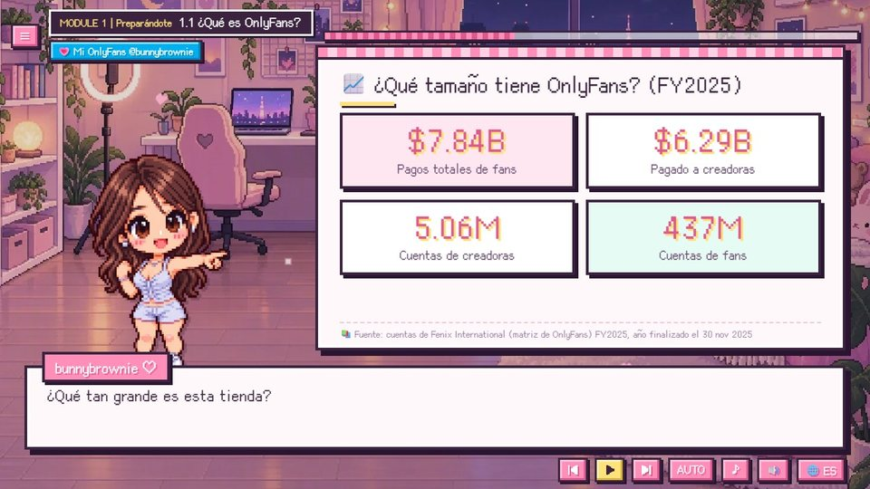</td>
<td>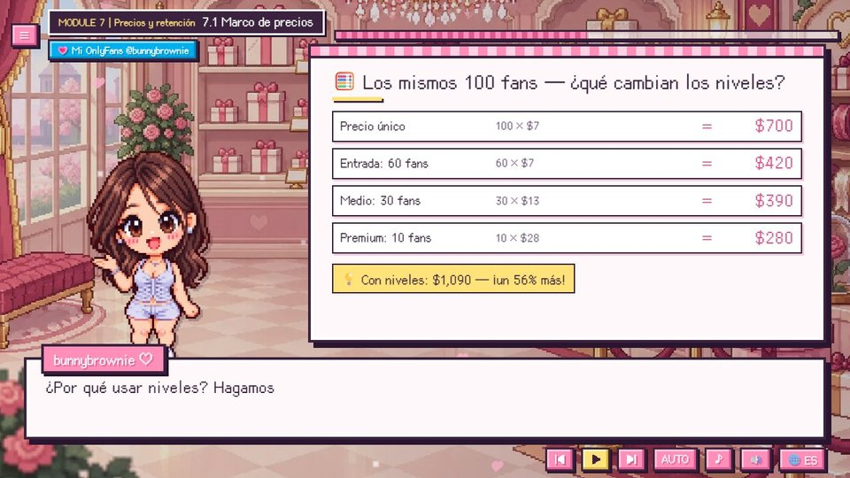</td>
<td>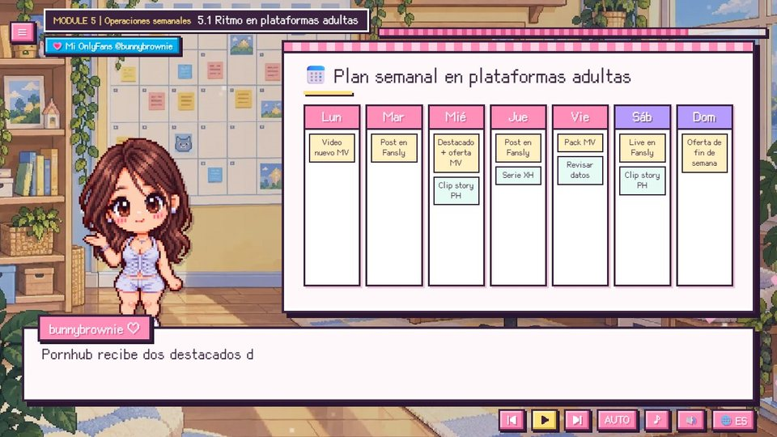</td>
</tr>
<tr>
<td align="center">Datos reales, con fuentes</td>
<td align="center">Precios por niveles: los mismos 100 fans, 56% más ingresos</td>
<td align="center">Un plan semanal que puedes copiar</td>
</tr>
<tr>
<td>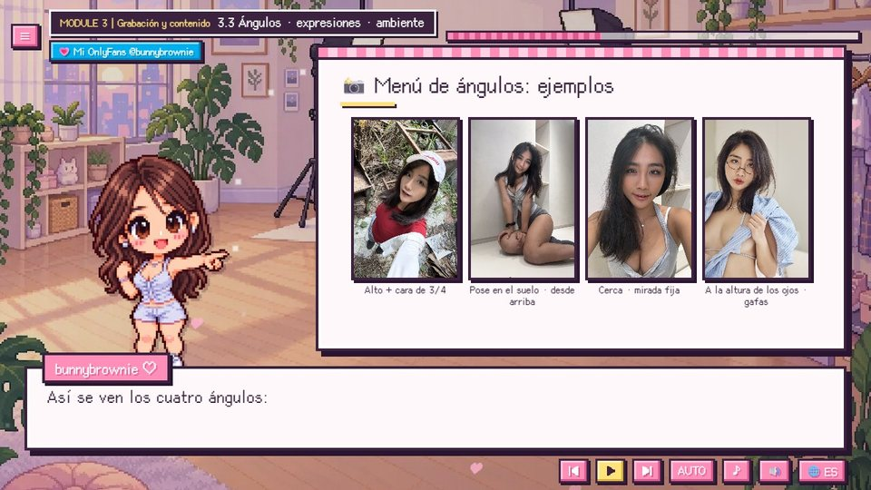</td>
<td>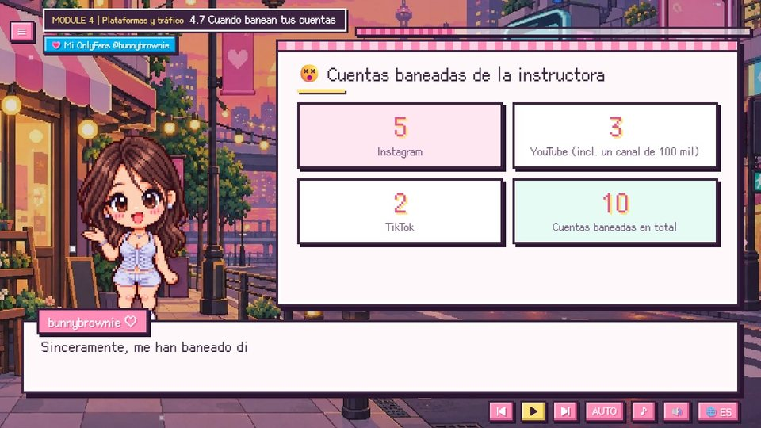</td>
<td>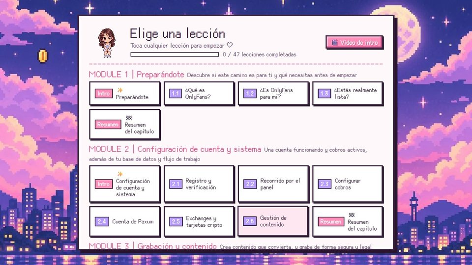</td>
</tr>
<tr>
<td align="center">Menú de ángulos de cámara con fotos reales</td>
<td align="center">Las 10 cuentas que perdí — y la mentalidad correcta</td>
<td align="center">Menú de capítulos con tu progreso</td>
</tr>
</table>

---

## ✨ Características

<table>
<tr>
<td width="62%" valign="top">

- 🎙️ **Mi voz real** narra cada línea (en chino e inglés), con emoción, no es un robot.
- 🌏 **8 idiomas**: subtítulos y pizarras completamente traducidos; contenido específico por país solo donde aplica.
- 📱 **Teléfono, tablet y escritorio**: un diseño vertical dedicado cuando sostienes tu teléfono en posición vertical.
- ▶️ **Continúa donde lo dejaste**: la pantalla de título ofrece "Continuar" y reanuda exactamente en la misma línea.
- ✅ **Listas de verificación y calculadoras interactivas** que recuerdan tus respuestas.
- 📊 **Números reales con fuentes** en cada panel de datos.
- ⚡ **Ligero**: la primera visita descarga solo unos 260 KB.
- 💸 **Gratuito**, sin necesidad de registrarte.

</td>
<td width="38%" valign="top" align="center">
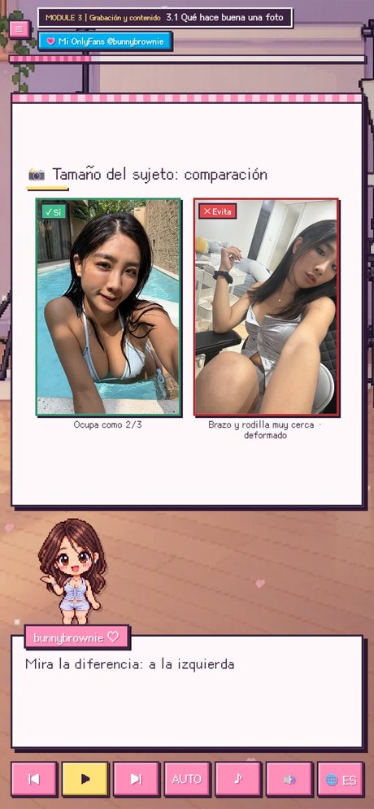
 Diseño vertical en un teléfono
</td>
</tr>
</table>

---

## 🌏 8 idiomas

| Idioma | Subtítulos | Voz |
|---|:-:|:-:|
| 繁體中文 (con lecciones específicas de Taiwán: documentos, intercambios locales, legislación de Taiwán) | ✅ | Chino |
| 简体中文 | ✅ | Chino |
| English | ✅ | Inglés |
| Español · Português · 日本語 · Deutsch · Français | ✅ | Inglés |

---

## 🔞 Verificación de edad

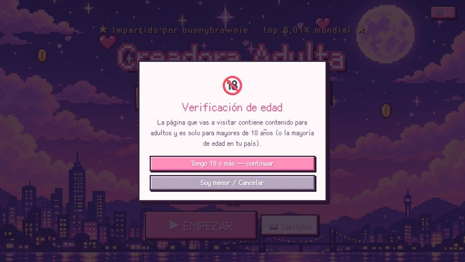

La primera vez que entres al curso, se te pedirá confirmar que tienes 18 años o más (solo se te preguntará una vez). El enlace a OnlyFans en cada pantalla vuelve a preguntar antes de abrirse.

---

## ▶️ Cómo verlo

- **En línea:** <https://bunnybrownie36.github.io/bunnybrownie-of-course/>
- **📱 Teléfono / tablet:** abre el mismo enlace en tu navegador móvil — sostenlo en vertical para el diseño en modo retrato, o gíralo de lado para pantalla ancha.
- **🎬 Video de introducción:** un breve video de presentación mío está disponible desde el menú de capítulos.
- **Sin conexión:** descarga este repositorio y abre `course/index.html` en tu navegador.
- **Teclado:** `Espacio` reproducir / pausar, `←` `→` línea anterior / siguiente.

### Notas
- Este curso es educación general y **no constituye asesoría legal, fiscal o financiera**. Las reglas de las plataformas cambian con frecuencia — revisa siempre los términos más recientes.
- Voz: Fish Audio · Música: Google Lyria 3.5 · Ilustraciones: GPT Image 2.5 · Fotos de ejemplo: tomadas por la creadora · Fuentes: [Cubic 11](https://github.com/ACh-K/Cubic-11), [Fusion Pixel Font](https://github.com/TakWolf/fusion-pixel-font) (SIL OFL 1.1)

**💗 [onlyfans.com/bunnybrownie](https://onlyfans.com/bunnybrownie)** (18+)

