

# 大人のメディア術 · OnlyFans 実践講座

**bunnybrownieが贈る、無料のピクセルアート・インタラクティブ講座 — 世界トップ0.01%のOnlyFansクリエイターによる**

[English](../../README.md) | [繁體中文](../../docs/zh-Hant/README.md) | [简体中文](../../docs/zh-Hans/README.md) | [Español](../../docs/es/README.md) | [Português](../../docs/pt/README.md) | **日本語** | [Deutsch](../../docs/de/README.md) | [Français](../../docs/fr/README.md)

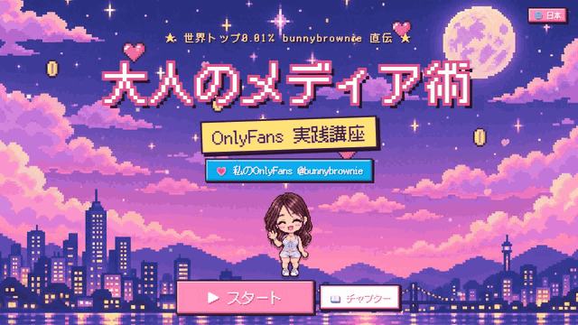

**💗 わたしのOnlyFans（18歳以上）：[onlyfans.com/bunnybrownie](https://onlyfans.com/bunnybrownie)**

> 🔞 **18歳以上限定。** この講座は、アダルトコンテンツ・クリエイタービジネスの運営についてのものです。わたし自身の示唆的なサンプル写真が含まれており、訪問者は入室前に年齢確認を行います。露骨な表現は含まれていません。

---

## 💌 この講座を作った理由

こんにちは、**bunnybrownie**です。わたしはゼロから始めて、世界トップ0.01%のOnlyFansクリエイターになりました。その道のりで、10個ものSNSアカウントをBANで失い、支払いで行き詰まり、売れなかったコンテンツもたくさん撮影してきました。そこで学んだのは、ほとんどのクリエイターに足りないのは努力ではなく、**仕組み（システム）**だということです。

だからこそ、わたしが実際に使っているシステムをそのままこの講座にして、無料で公開することにしました。これがあなたの遠回りを少しでも減らし、安全でサステナブルなビジネスを築く助けになれば嬉しいです。実際のシステムを見てみたい方は、[OnlyFans](https://onlyfans.com/bunnybrownie)（18歳以上限定）でわたしに会いに来てくださいね。

---

## 🎬 ちょっと覗いてみてください

<table>
<tr>
<td width="50%" valign="top">
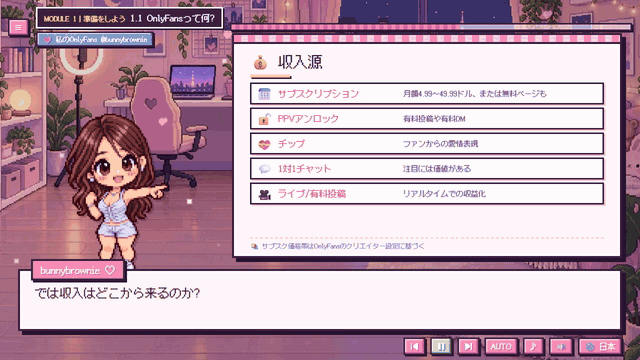
 <b>ピクセルホスト＋アニメーションホワイトボード</b> 音声ナレーション、タイプライター風字幕、そして一つずつ表示されるポイント。
</td>
<td width="50%" valign="top">
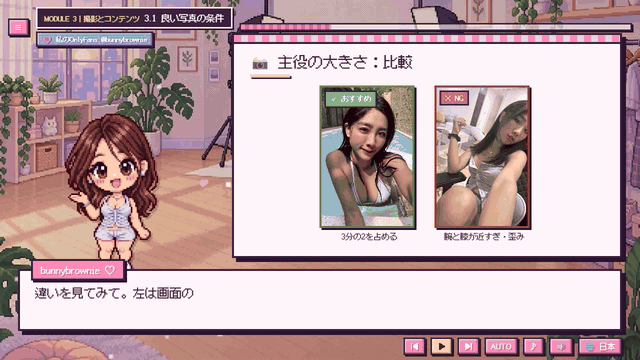
 <b>本物の写真サンプル</b> 光、フレーミング、被写体のサイズ、カメラアングル — Do / Don'tを並べて、わたし自身が撮影しました。
</td>
</tr>
<tr>
<td width="50%" valign="top">
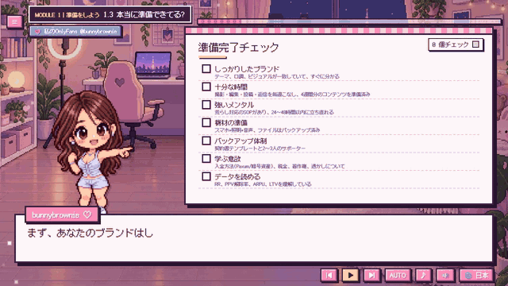
 <b>インタラクティブなチェックリスト</b> 進めながら項目にチェックを入れると、赤・黄・緑の準備度スコアが表示されます。あなたの回答は保存されます。
</td>
<td width="50%" valign="top">

 <b>8言語対応、ワンクリックで切替</b> いつでも言語を切り替え可能 — レッスンの続きはそのまま維持されます。
</td>
</tr>
</table>

---

## 🗺️ コースマップ

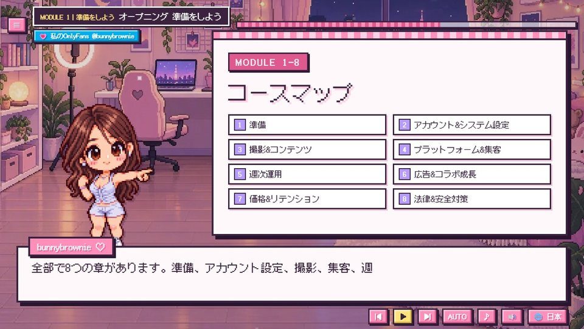

| # | モジュール | 学べること |
|:-:|---|---|
| 1 | **準備をしよう** | この道が自分に合っているか、始める前に必要なものを知ろう |
| 2 | **アカウント＆システム設定** | アカウントと支払い設定を整えて、基礎データとワークフローも完成させよう |
| 3 | **撮影とコンテンツ** | 売れるコンテンツを作って、安全に・合法的に撮影できるようになる |
| 4 | **プラットフォーム&トラフィック** | 外部トラフィック網を作って、リーチとコンバージョンをアップ |
| 5 | **週次運営** | 毎週のリズムで運営しながら、コンテンツと関係性をどんどん良くしていく |
| 6 | **Ads & Collab Growth** | Master paid and free growth channels to acquire fans efficiently |
| 7 | **料金設定とリテンション** | どのファン層にも「入ってよかった」と思ってもらって、LTVと継続率をアップさせよう |
| 8 | **法律と安全対策** | 安全かつ合法的に運営して、高リスクや無駄な損失を避けよう |

<table>
<tr>
<td>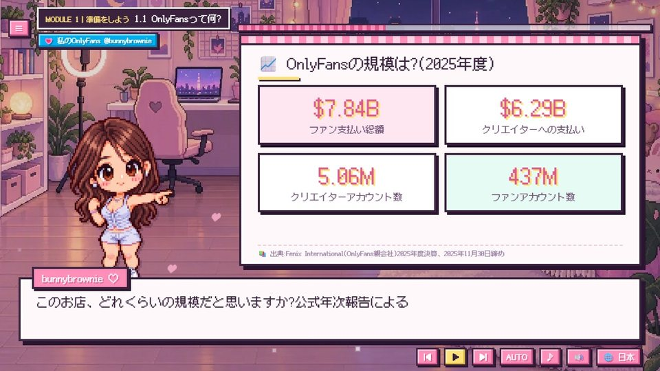</td>
<td>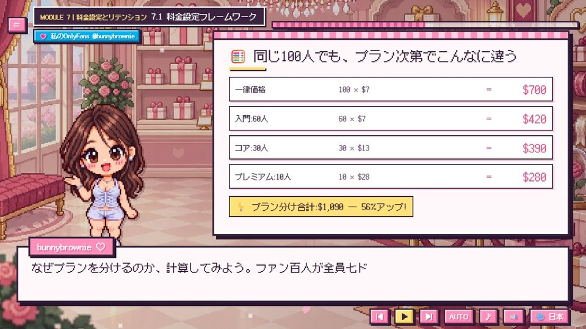</td>
<td>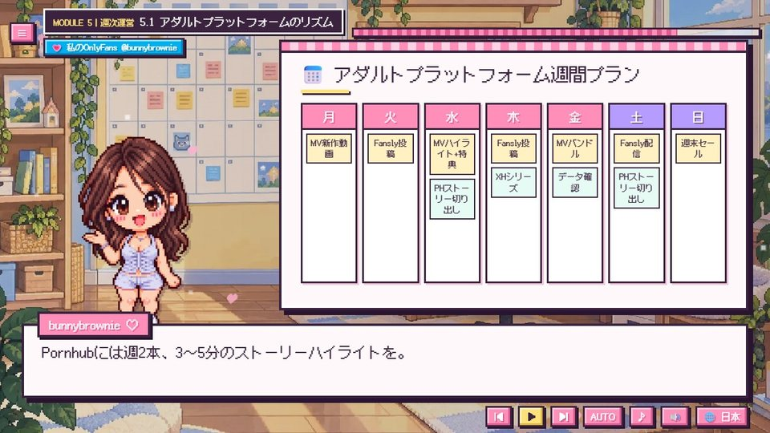</td>
</tr>
<tr>
<td align="center">出典付きのリアルなデータ</td>
<td align="center">階層型プライシング：同じ100人のファンで収益56%アップ</td>
<td align="center">そのまま真似できる週間プラン</td>
</tr>
<tr>
<td>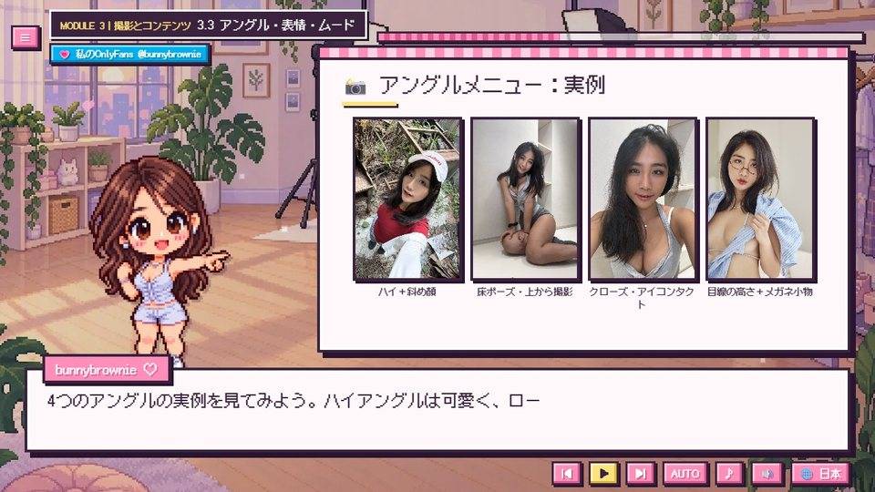</td>
<td>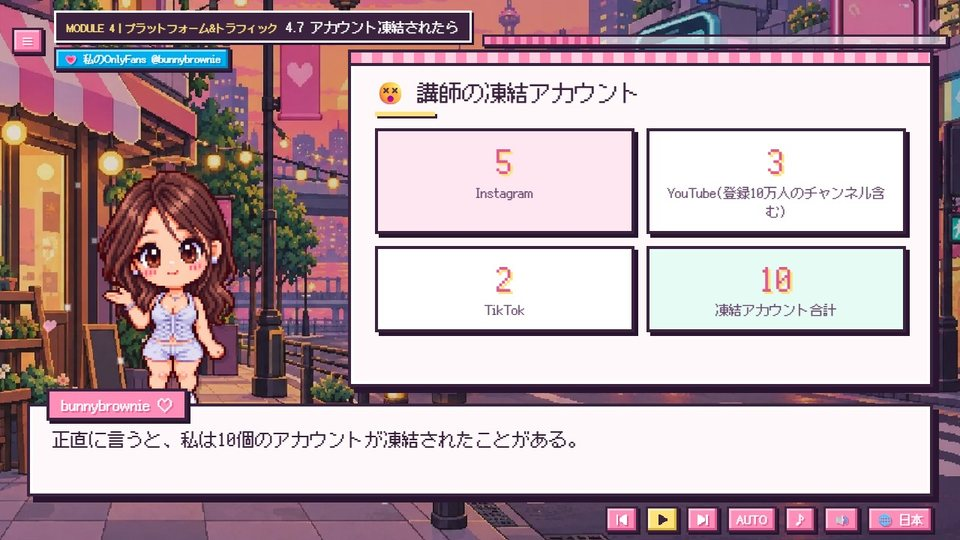</td>
<td>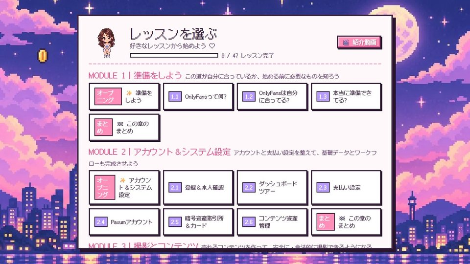</td>
</tr>
<tr>
<td align="center">実際の写真付きカメラアングルメニュー</td>
<td align="center">わたしが失った10個のアカウント — そして正しいマインドセット</td>
<td align="center">進捗が見えるチャプターメニュー</td>
</tr>
</table>

---

## ✨ 特徴

<table>
<tr>
<td width="62%" valign="top">

- 🎙️ **わたし自身の声**がすべてのセリフをナレーション（中国語・英語）。ロボットではなく、感情のこもった声です。
- 🌏 **8言語対応**：字幕とホワイトボードは完全に翻訳済み。該当する場合のみ国・地域別のコンテンツも。
- 📱 **スマホ・タブレット・デスクトップ対応**：スマホを縦に持つと専用の縦型レイアウトに。
- ▶️ **続きから再開**：タイトル画面に「Continue」が表示され、正確なセリフの位置から再開できます。
- ✅ **インタラクティブなチェックリストと計算機**、回答は記憶されます。
- 📊 **出典付きのリアルな数字**を、すべてのデータボードに掲載。
- ⚡ **軽量設計**：初回訪問時のダウンロードはわずか約260KB。
- 💸 **無料**、サインアップ不要。

</td>
<td width="38%" valign="top" align="center">
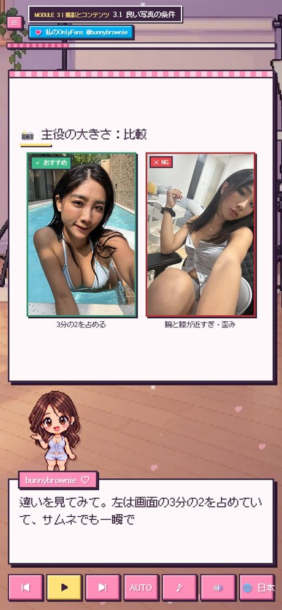
 スマホの縦型レイアウト
</td>
</tr>
</table>

---

## 🌏 8言語対応

| 言語 | 字幕 | 音声 |
|---|:-:|:-:|
| 繁體中文（台湾限定レッスン付き：各種書類、現地取引所、台湾の法律） | ✅ | 中国語 |
| 简体中文 | ✅ | 中国語 |
| English | ✅ | 英語 |
| Español · Português · 日本語 · Deutsch · Français | ✅ | 英語 |

---

## 🔞 年齢確認

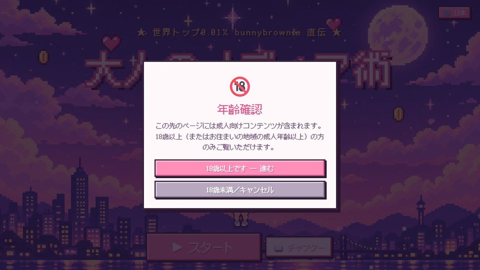

講座に初めて入る際、18歳以上であることの確認を求められます（確認は一度のみです）。各画面にあるOnlyFansリンクは、開く前に再度確認が入ります。

---

## ▶️ 視聴方法

- **オンライン：** <https://bunnybrownie36.github.io/bunnybrownie-of-course/>
- **📱 スマホ・タブレット：** 同じリンクをモバイルブラウザで開いてください — 縦向きで持つと縦型レイアウトに、横向きにするとワイドスクリーンになります。
- **🎬 イントロ動画：** わたしからの短いイントロ動画は、チャプターメニューからご覧いただけます。
- **オフライン：** このリポジトリをダウンロードし、ブラウザで `course/index.html` を開いてください。
- **キーボード操作：** `Space` で再生／一時停止、`←` `→` で前後のセリフに移動。

### 補足
- この講座は一般的な教育コンテンツであり、**法律・税務・financial上のアドバイスではありません**。プラットフォームのルールは頻繁に変わるため、必ず最新の規約をご確認ください。
- 音声：Fish Audio · 音楽：Google Lyria 3.5 · イラスト：GPT Image 2.5 · サンプル写真：クリエイター本人による撮影 · フォント：[Cubic 11](https://github.com/ACh-K/Cubic-11)、[Fusion Pixel Font](https://github.com/TakWolf/fusion-pixel-font)（SIL OFL 1.1）

**💗 [onlyfans.com/bunnybrownie](https://onlyfans.com/bunnybrownie)**（18歳以上限定）

