

# Criadora Adulta · Curso prático de OnlyFans

**Um curso interativo em pixel art, gratuito, criado por bunnybrownie, criadora que está entre o top 0,01% global do OnlyFans**

[English](../../README.md) | [繁體中文](../../docs/zh-Hant/README.md) | [简体中文](../../docs/zh-Hans/README.md) | [Español](../../docs/es/README.md) | **Português** | [日本語](../../docs/ja/README.md) | [Deutsch](../../docs/de/README.md) | [Français](../../docs/fr/README.md)

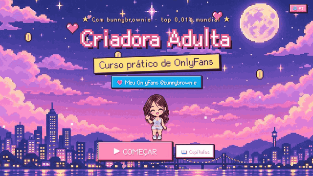

**💗 Meu OnlyFans (18+): [onlyfans.com/bunnybrownie](https://onlyfans.com/bunnybrownie)**

> 🔞 **Somente para adultos (18+).** Este curso é sobre como administrar um negócio de criadora de conteúdo adulto. Ele inclui fotos sugestivas minhas como exemplo, e os visitantes confirmam a idade antes de entrar. Não contém material explícito.

---

## 💌 Por que eu criei isso

Oi, eu sou a **bunnybrownie**. Eu saí do zero e cheguei ao top 0,01% global das criadoras do OnlyFans. No caminho, perdi dez contas de redes sociais por banimento, fiquei travada em pagamentos e gravei muito conteúdo que nunca vendeu. O que aprendi é que a maioria das criadoras não falta esforço — falta **sistema**.

Então transformei o sistema exato que eu uso neste curso, e o tornei gratuito. Espero que ele te poupe alguns desvios de caminho e te ajude a construir algo seguro e sustentável. Quer ver o sistema em ação? Vem me encontrar no [OnlyFans](https://onlyfans.com/bunnybrownie) (somente 18+).

---

## 🎬 Dá uma olhada

<table>
<tr>
<td width="50%" valign="top">
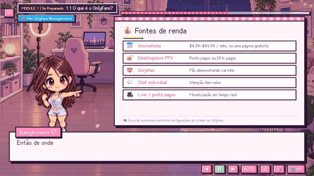
 <b>Anfitriã em pixel + quadros brancos animados</b> Narração com voz, legendas estilo máquina de escrever e pontos-chave que aparecem um a um.
</td>
<td width="50%" valign="top">
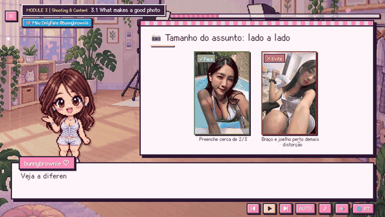
 <b>Exemplos de fotos reais</b> Luz, enquadramento, tamanho do assunto e ângulos de câmera — certo e errado lado a lado, fotografado por mim.
</td>
</tr>
<tr>
<td width="50%" valign="top">
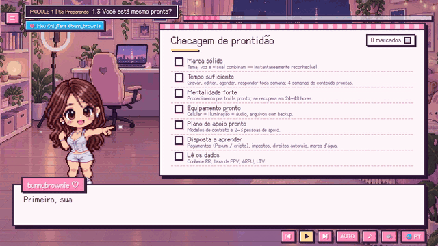
 <b>Checklists interativas</b> Marque itens conforme avança e receba uma pontuação de preparo vermelho/amarelo/verde. Suas respostas são salvas.
</td>
<td width="50%" valign="top">

 <b>8 idiomas, um clique</b> Troque de idioma a qualquer momento — a lição mantém o lugar onde você estava.
</td>
</tr>
</table>

---

## 🗺️ Mapa do curso

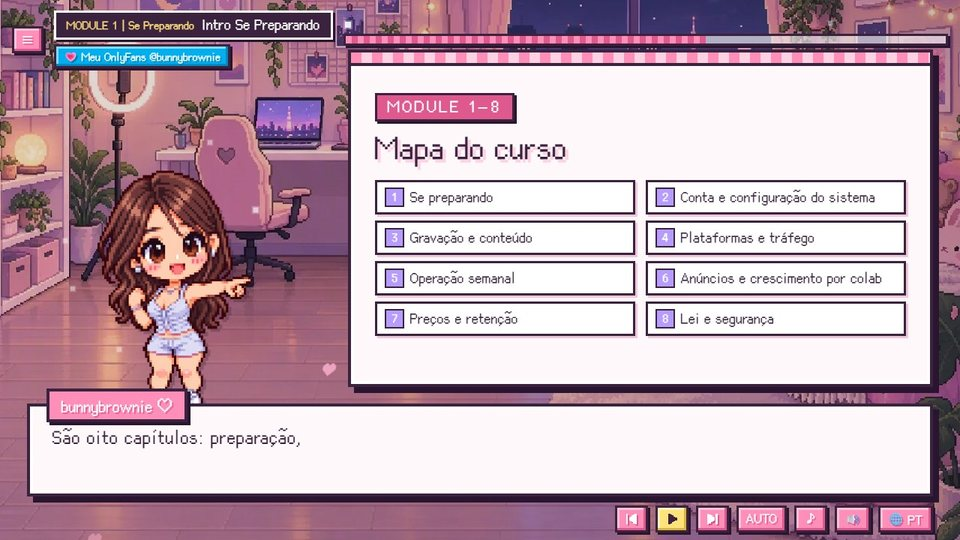

| # | Módulo | O que você vai aprender |
|:-:|---|---|
| 1 | **Se Preparando** | Saiba se esse caminho combina com você e o que precisa antes de começar |
| 2 | **Configuração de Conta e Sistema** | Uma conta funcionando e pagamentos ativos, além dos seus dados base e fluxo de trabalho |
| 3 | **Shooting & Content** | Crie conteúdo que converte, e filme com segurança e dentro da lei |
| 4 | **Plataformas & Tráfego** | Construa uma rede de tráfego externo para aumentar alcance e conversão |
| 5 | **Operações Semanais** | Manter um ritmo semanal e continuar melhorando conteúdo e relacionamentos |
| 6 | **Crescimento com Anúncios e Parcerias** | Domine canais de crescimento pagos e gratuitos para conquistar fãs com eficiência |
| 7 | **Preço & Retenção** | Faça cada nível de fã sentir que vale a pena, e aumente o LTV e as renovações |
| 8 | **Lei & Segurança** | Opere com segurança e dentro da lei, evitando riscos altos e perdas desnecessárias |

<table>
<tr>
<td>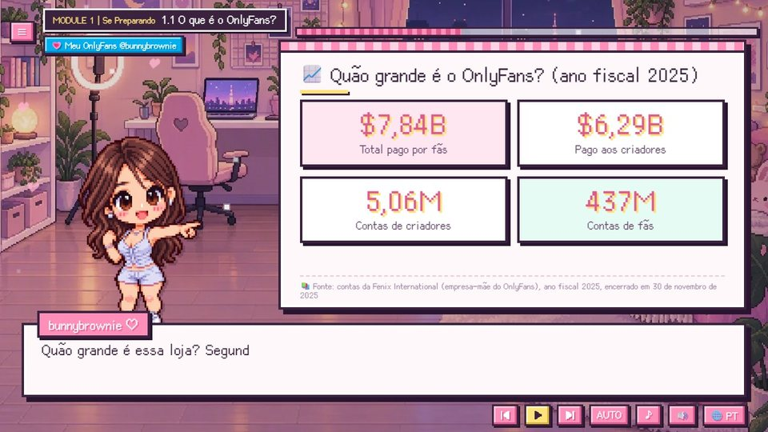</td>
<td>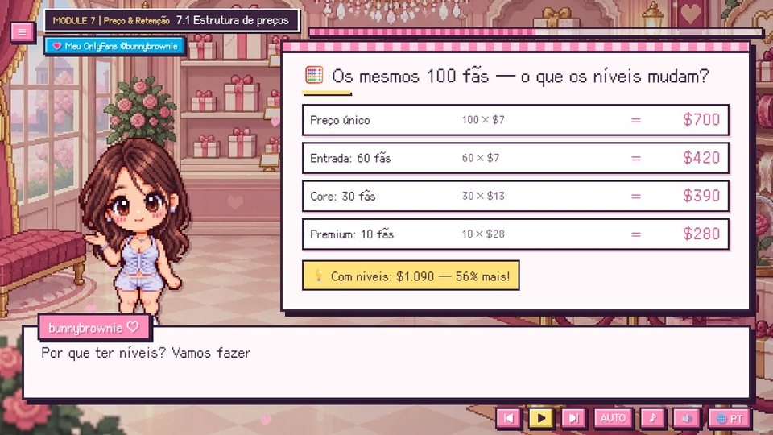</td>
<td>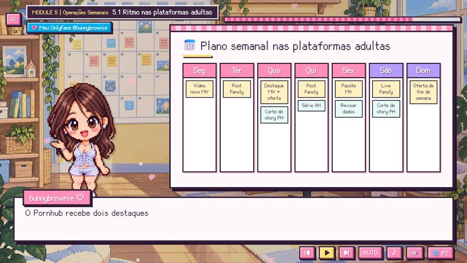</td>
</tr>
<tr>
<td align="center">Dados reais, com fontes</td>
<td align="center">Preços em níveis: os mesmos 100 fãs, 56% mais receita</td>
<td align="center">Um plano semanal que você pode copiar</td>
</tr>
<tr>
<td>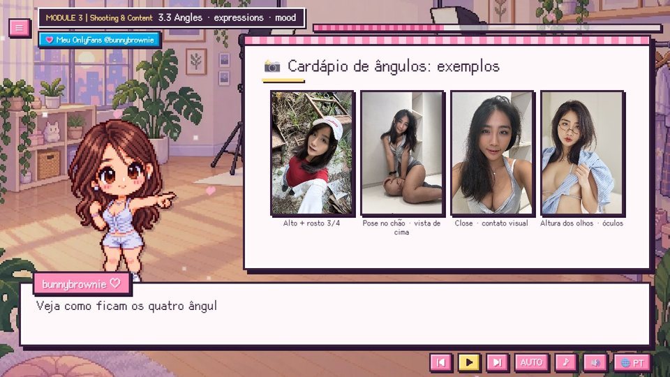</td>
<td>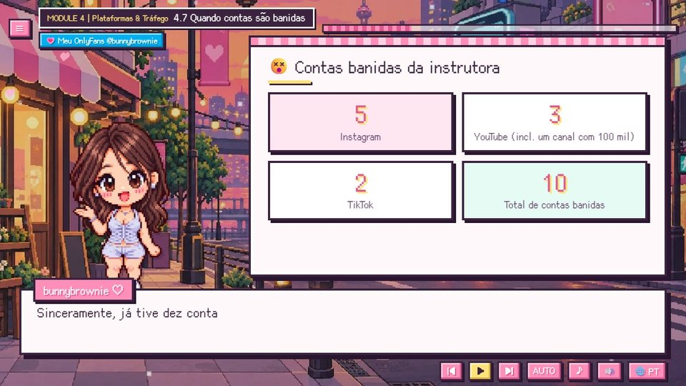</td>
<td>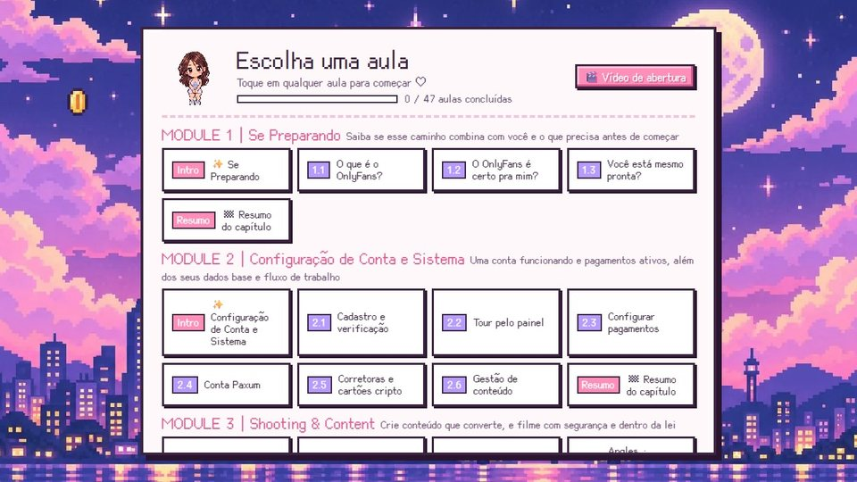</td>
</tr>
<tr>
<td align="center">Menu de ângulos de câmera com fotos reais</td>
<td align="center">As 10 contas que perdi — e a mentalidade certa</td>
<td align="center">Menu de capítulos com seu progresso</td>
</tr>
</table>

---

## ✨ Recursos

<table>
<tr>
<td width="62%" valign="top">

- 🎙️ **Minha voz real** narra cada linha (em chinês e inglês), com emoção — nada de robô.
- 🌏 **8 idiomas**: legendas e quadros brancos totalmente traduzidos; conteúdo específico de cada país apenas onde se aplica.
- 📱 **Celular, tablet e desktop**: um layout retrato dedicado quando você segura o celular na vertical.
- ▶️ **Continua de onde você parou**: a tela de título oferece "Continuar" e retoma exatamente na linha em que você estava.
- ✅ **Checklists e calculadoras interativas** que lembram suas respostas.
- 📊 **Números reais com fontes** em cada painel de dados.
- ⚡ **Leve**: a primeira visita baixa apenas cerca de 260 KB.
- 💸 **Gratuito**, sem cadastro.

</td>
<td width="38%" valign="top" align="center">
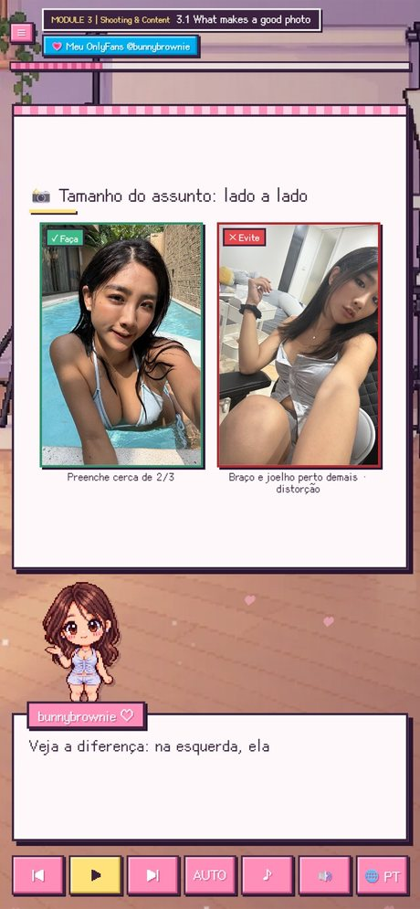
 Layout retrato no celular
</td>
</tr>
</table>

---

## 🌏 8 idiomas

| Idioma | Legendas | Voz |
|---|:-:|:-:|
| 繁體中文 (com lições específicas de Taiwan: documentos, câmbio local, legislação de Taiwan) | ✅ | Chinês |
| 简体中文 | ✅ | Chinês |
| English | ✅ | Inglês |
| Español · Português · 日本語 · Deutsch · Français | ✅ | Inglês |

---

## 🔞 Verificação de idade

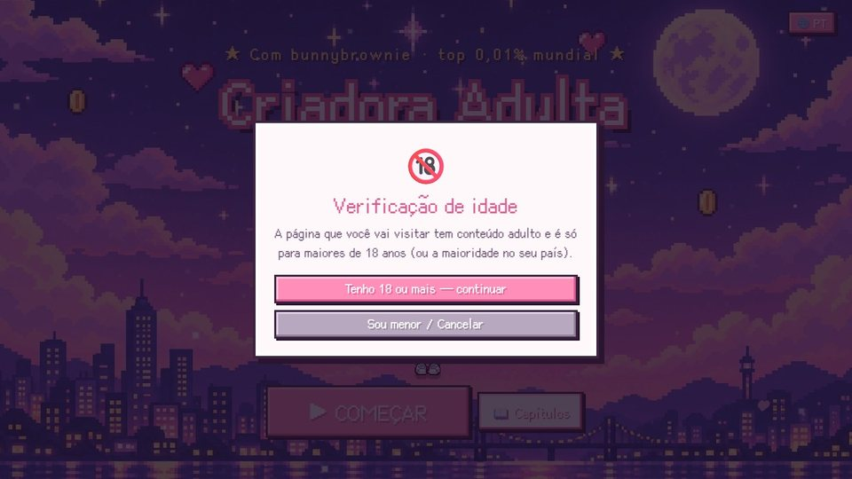

Na primeira vez que você entrar no curso, será pedido que confirme que você tem 18 anos ou mais (isso é perguntado apenas uma vez). O link do OnlyFans em cada tela pergunta novamente antes de abrir.

---

## ▶️ Como assistir

- **Online:** <https://bunnybrownie36.github.io/bunnybrownie-of-course/>
- **📱 Celular / tablet:** abra o mesmo link no navegador do seu celular — segure na vertical para o layout retrato, ou vire de lado para widescreen.
- **🎬 Vídeo de introdução:** um breve vídeo de introdução meu está disponível no menu de capítulos.
- **Offline:** baixe este repositório e abra `course/index.html` no seu navegador.
- **Teclado:** `Espaço` play / pausa, `←` `→` linha anterior / próxima.

### Observações
- Este curso é educação geral e **não é aconselhamento jurídico, tributário ou financeiro**. As regras das plataformas mudam com frequência — sempre confira os termos mais recentes.
- Voz: Fish Audio · Música: Google Lyria 3.5 · Ilustrações: GPT Image 2.5 · Fotos de exemplo: fotografadas pela criadora · Fontes: [Cubic 11](https://github.com/ACh-K/Cubic-11), [Fusion Pixel Font](https://github.com/TakWolf/fusion-pixel-font) (SIL OFL 1.1)

**💗 [onlyfans.com/bunnybrownie](https://onlyfans.com/bunnybrownie)** (18+)

