

# 大人的自媒体：OnlyFans 实战课

**由全球前0.01%的OnlyFans创作者bunnybrownie倾心打造的免费像素风互动课程**

[English](../../README.md) | [繁體中文](../../docs/zh-Hant/README.md) | **简体中文** | [Español](../../docs/es/README.md) | [Português](../../docs/pt/README.md) | [日本語](../../docs/ja/README.md) | [Deutsch](../../docs/de/README.md) | [Français](../../docs/fr/README.md)

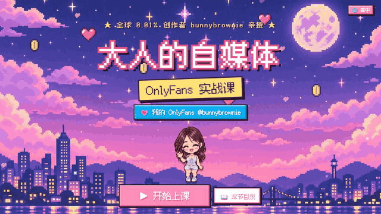

**▶ [立即开始免费课程](https://bunnybrownie36.github.io/bunnybrownie-of-course/)** · 💗 我的主页（18+）链接就在课程内

> 🔞 **仅限成人（18+）。** 本课程讲述的是如何经营一门成人内容创作者的生意。其中包含我的部分性感示例照片，访客需先确认年龄才能进入。课程本身不含露骨内容。

---

## 💌 我为什么要做这个

大家好，我是**bunnybrownie**。我从零开始，一路做到了全球OnlyFans创作者的前0.01%。这一路上，我曾因平台封禁失去过十个社交媒体账号，被卡在收款环节动弹不得，也拍过很多最终根本卖不出去的内容。我学到的是：大多数创作者缺的不是努力，而是一套**系统**。

所以我把自己正在用的这套系统原封不动地做成了这门课程，并且免费公开。希望它能帮你少走一些弯路，帮你搭建一份安全又可持续的事业。想看看这套系统实际运作的样子吗？课程里就有链接通向我的主页（仅限18+）。

---

## 🎬 先来看看

<table>
<tr>
<td width="50%" valign="top">
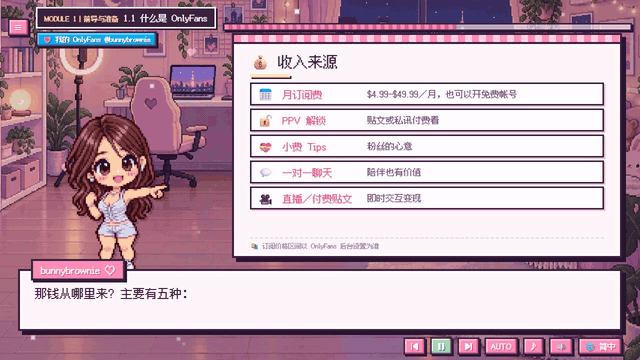
 <b>像素主持人 + 动态白板</b> 真人语音讲解，打字机式字幕，重点内容逐条浮现。
</td>
<td width="50%" valign="top">
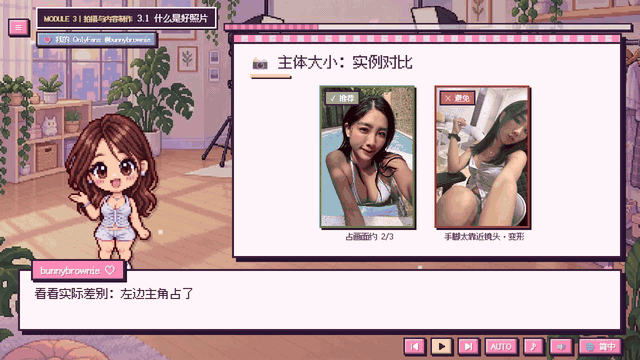
 <b>真实照片示例</b> 光线、取景、主体大小与拍摄角度——正确与错误示范并排展示，均由我亲自拍摄。
</td>
</tr>
<tr>
<td width="50%" valign="top">
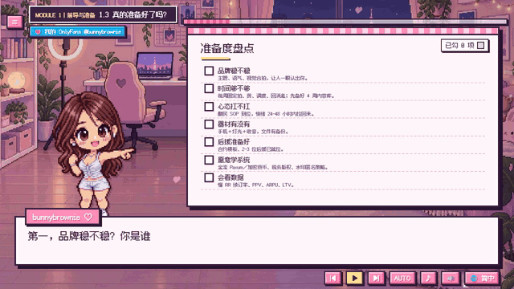
 <b>互动检查清单</b> 边学边勾选，自动生成红／黄／绿的准备度评分，你的答案会被保存下来。
</td>
<td width="50%" valign="top">

 <b>8种语言，一键切换</b> 随时切换语言，课程进度不会丢失。
</td>
</tr>
</table>

---

## 🗺️ 课程地图

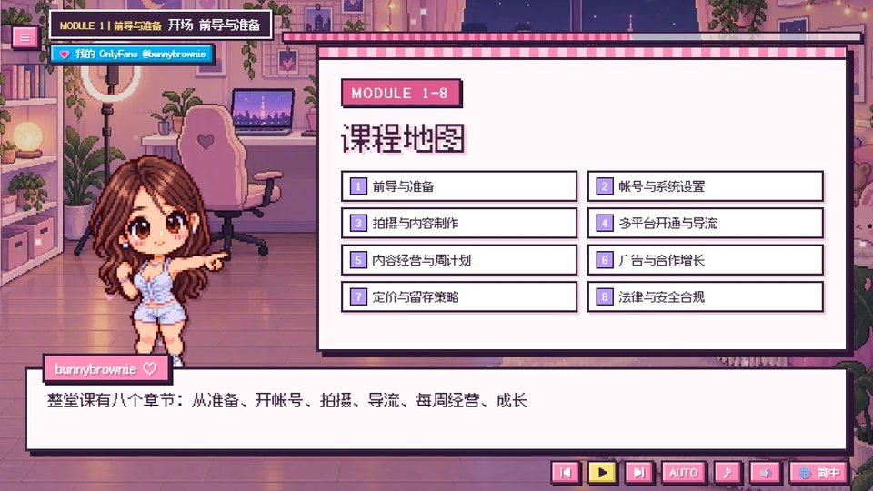

| # | 章节 | 你会学到 |
|:-:|---|---|
| 1 | **前导与准备** | 清楚个人可行性与目标，确认投入前的必要条件 |
| 2 | **帐号与系统设置** | 完成可营运的帐号与金流；创建基础数据与工作流 |
| 3 | **拍摄与内容制作** | 能产出可转换的影像内容，并安全合规拍摄 |
| 4 | **多平台开通与导流** | 创建外部导流矩阵，提升触达与转化 |
| 5 | **内容经营与周计划** | 创建周期化运营节奏，持续优化内容与关系 |
| 6 | **广告与合作增长** | 掌握付费与免费增长管道，提升获客效率 |
| 7 | **定价与留存策略** | 让不同层级粉丝“都感觉值得”，提高 LTV 与续订率 |
| 8 | **法律与安全合规** | 合规安心经营，避免高风险与不必要损失 |

<table>
<tr>
<td>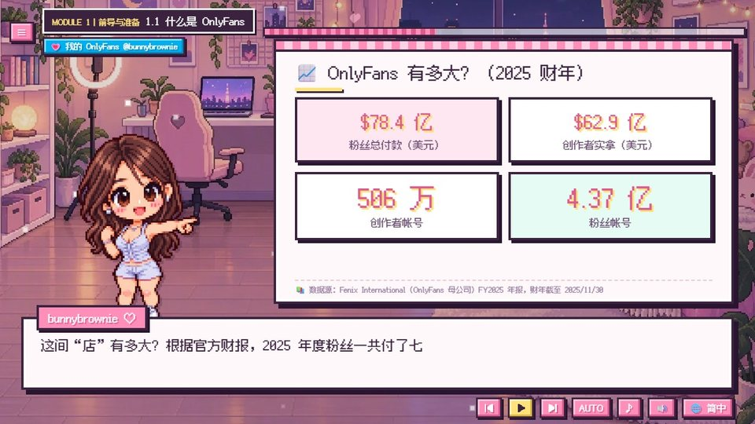</td>
<td>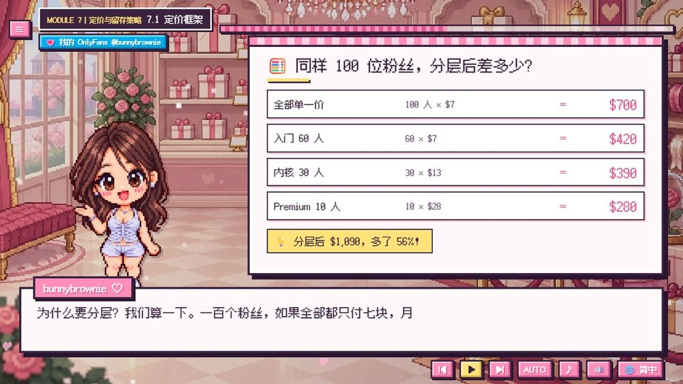</td>
<td>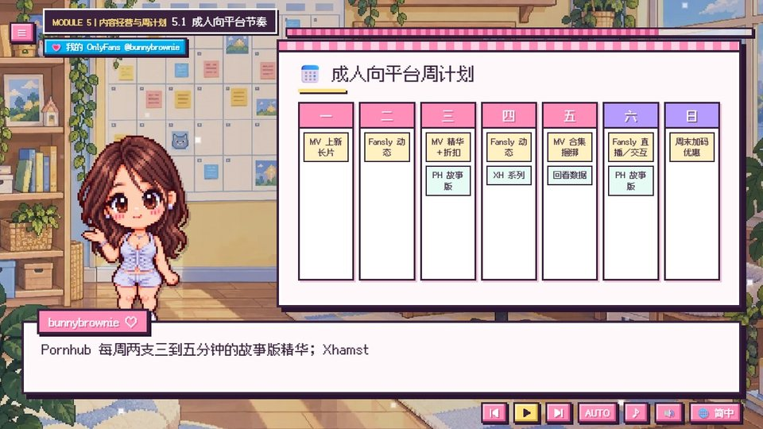</td>
</tr>
<tr>
<td align="center">真实数据，附来源</td>
<td align="center">阶梯定价：同样100位粉丝，收入多出56%</td>
<td align="center">一份可以直接套用的每周计划</td>
</tr>
<tr>
<td>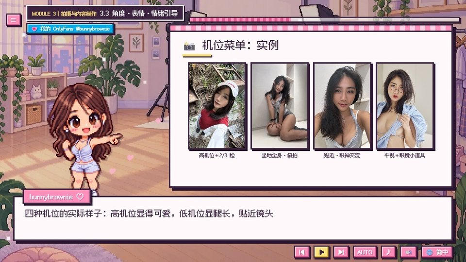</td>
<td>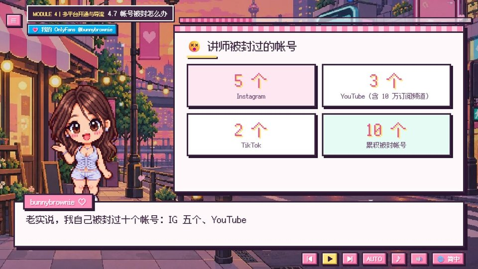</td>
<td>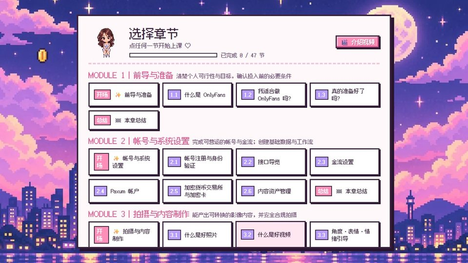</td>
</tr>
<tr>
<td align="center">附真实照片的拍摄角度菜单</td>
<td align="center">我失去的那10个账号——以及应有的正确心态</td>
<td align="center">带进度显示的章节菜单</td>
</tr>
</table>

---

## ✨ 功能特色

<table>
<tr>
<td width="62%" valign="top">

- 🎙️ **真人原声讲解**：每一句台词（中文与英文）都由我亲自配音，充满情感，而不是机械的朗读。
- 🌏 **8种语言**：字幕与白板内容均完整翻译，仅在适用的情况下才呈现特定国家／地区的内容。
- 📱 **手机、平板与电脑皆可用**：竖持手机时会自动切换为专属竖屏版式。
- ▶️ **断点续学**：标题画面提供「继续」选项，可精准恢复到上次观看的那一句。
- ✅ **互动检查清单与计算器**：会自动记住你的答案。
- 📊 **真实数据，附来源**：每个数据看板都有出处可查。
- ⚡ **轻量级**：初次访问仅需下载约260 KB。
- 💸 **完全免费**，无需注册。

</td>
<td width="38%" valign="top" align="center">
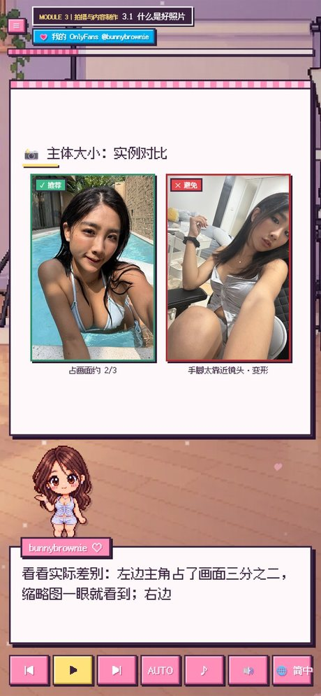
 手机竖屏版式
</td>
</tr>
</table>

---

## 🌏 8种语言

| 语言 | 字幕 | 配音 |
|---|:-:|:-:|
| 繁體中文（含台湾专属课程：文件资料、本地交流方式、台湾相关法规） | ✅ | 中文 |
| 简体中文 | ✅ | 中文 |
| English | ✅ | 英文 |
| Español · Português · 日本語 · Deutsch · Français | ✅ | 英文 |

---

## 🔞 年龄确认

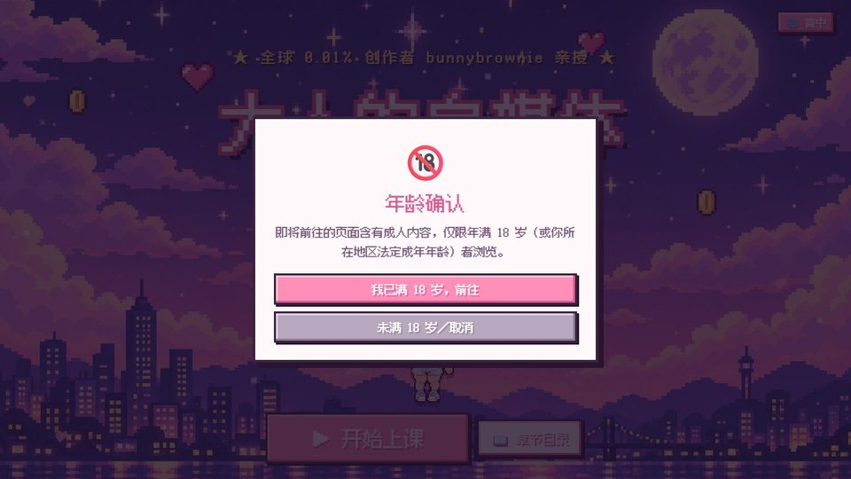

首次进入课程时，系统会要求你确认已满18岁（只会询问一次）。每个画面中通向我主页的链接，在打开前都会再次询问确认。

---

## ▶️ 如何观看

- **在线观看：** <https://bunnybrownie36.github.io/bunnybrownie-of-course/>
- **📱 手机／平板：** 在手机浏览器中打开同一链接——竖持可获得竖屏版式，横放则切换为宽屏版式。
- **🎬 介绍视频：** 章节菜单中有一段我亲自录制的简短开场介绍。
- **离线观看：** 下载本仓库后，在浏览器中打开 `course/index.html` 即可。
- **键盘操作：** `Space` 播放／暂停，`←` `→` 上一句／下一句。

### 说明
- 本课程属于通识教育内容，**不构成法律、税务或财务方面的专业建议**。各平台规则时常变动，请务必以最新条款为准。
- 配音：Fish Audio · 音乐：Google Lyria 3.5 · 插画：GPT Image 2.5 · 示例照片：由创作者本人拍摄 · 字体：[Cubic 11](https://github.com/ACh-K/Cubic-11)、[Fusion Pixel Font](https://github.com/TakWolf/fusion-pixel-font)（SIL OFL 1.1）

**▶ [立即开始免费课程](https://bunnybrownie36.github.io/bunnybrownie-of-course/)**

