

# 大人的自媒體：OnlyFans 實戰課

**由 bunnybrownie 打造的免費互動式像素風課程，她是全球前 0.01% 的 OnlyFans 創作者**

[English](../../README.md) | **繁體中文** | [简体中文](../../docs/zh-Hans/README.md) | [Español](../../docs/es/README.md) | [Português](../../docs/pt/README.md) | [日本語](../../docs/ja/README.md) | [Deutsch](../../docs/de/README.md) | [Français](../../docs/fr/README.md)

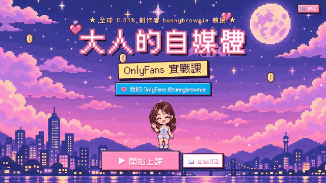

**▶ [開始免費課程](https://bunnybrownie36.github.io/bunnybrownie-of-course/)** · 💗 我的頁面（18+）連結就在課程裡面

> 🔞 **僅限成人（18+）。** 這個課程是在講怎麼經營成人內容創作者這份事業。裡面會有一些我的曖昧示範照，訪客在進入前要先確認年齡。課程內容不包含任何露骨素材。

---

## 💌 我為什麼要做這個

嗨，我是**bunnybrownie**。我從零開始，一路做到全球前 0.01% 的 OnlyFans 創作者。這一路上，我有十個社群帳號被封鎖，款項被卡住過，也拍了不少完全賣不出去的內容。我學到的是：大多數創作者缺的不是努力，而是缺一套**系統**。

所以我把自己實際在用的這套系統，整理成了這個課程，而且完全免費。希望它能幫你少走一些彎路，幫你打造出安全又能長久經營的事業。想親眼看看這套系統實際運作嗎？課程裡面有我的頁面連結（僅限 18+）。

---

## 🎬 搶先看一眼

<table>
<tr>
<td width="50%" valign="top">
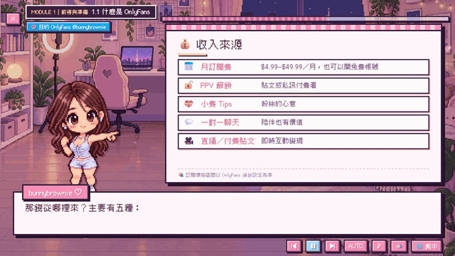
 <b>像素主持人＋動態白板</b> 有語音講解、打字機字幕效果，重點一個接一個慢慢浮現。
</td>
<td width="50%" valign="top">
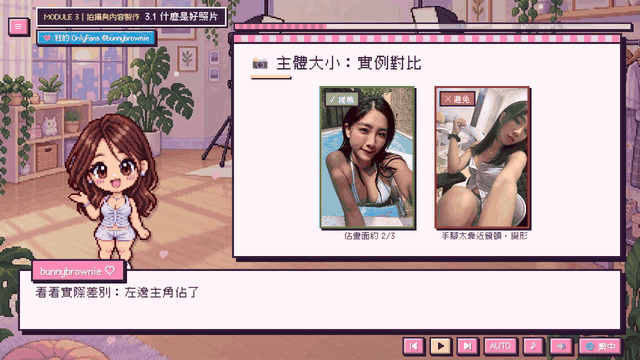
 <b>真實照片示範</b> 燈光、構圖、主體大小與拍攝角度——好的壞的並排對比，全部由我親自拍攝。
</td>
</tr>
<tr>
<td width="50%" valign="top">
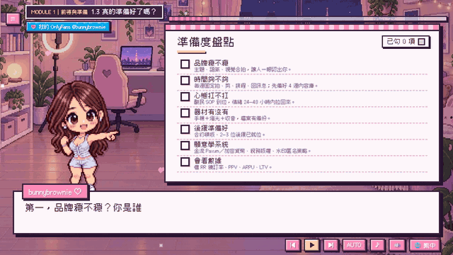
 <b>互動式檢查清單</b> 邊看邊打勾，馬上得到紅／黃／綠的準備度評分。你的答案會自動儲存。
</td>
<td width="50%" valign="top">

 <b>8 種語言，一鍵切換</b> 隨時切換語言，課程進度完全不會跑掉。
</td>
</tr>
</table>

---

## 🗺️ 課程地圖

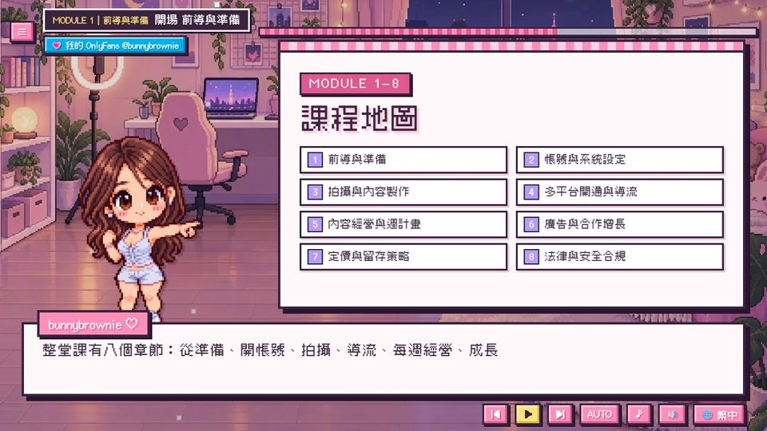

| # | 章節 | 你會學到 |
|:-:|---|---|
| 1 | **前導與準備** | 清楚個人可行性與目標，確認投入前的必要條件 |
| 2 | **帳號與系統設定** | 完成可營運的帳號與金流；建立基礎資料與工作流 |
| 3 | **拍攝與內容製作** | 能產出可轉換的影像內容，並安全合規拍攝 |
| 4 | **多平台開通與導流** | 建立外部導流矩陣，提升觸達與轉化 |
| 5 | **內容經營與週計畫** | 建立週期化運營節奏，持續優化內容與關係 |
| 6 | **廣告與合作增長** | 掌握付費與免費增長管道，提升獲客效率 |
| 7 | **定價與留存策略** | 讓不同層級粉絲「都感覺值得」，提高 LTV 與續訂率 |
| 8 | **法律與安全合規** | 合規安心經營，避免高風險與不必要損失 |

<table>
<tr>
<td>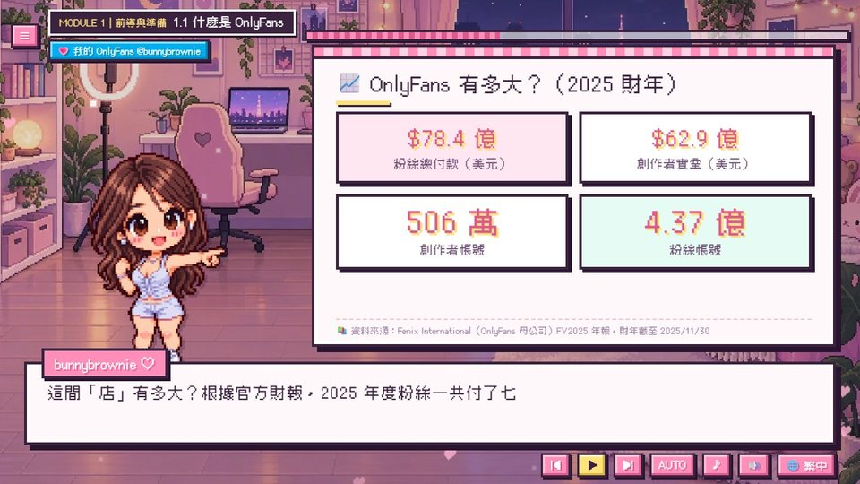</td>
<td>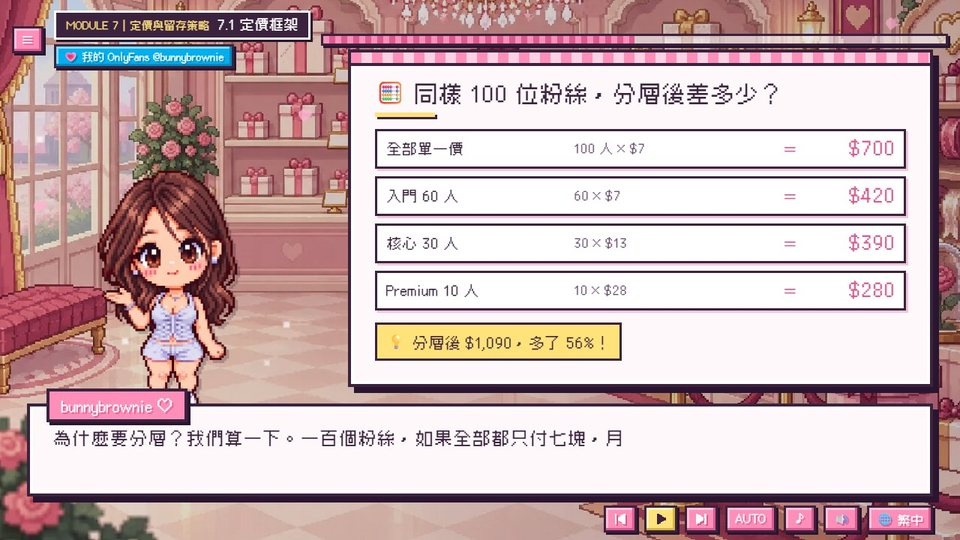</td>
<td>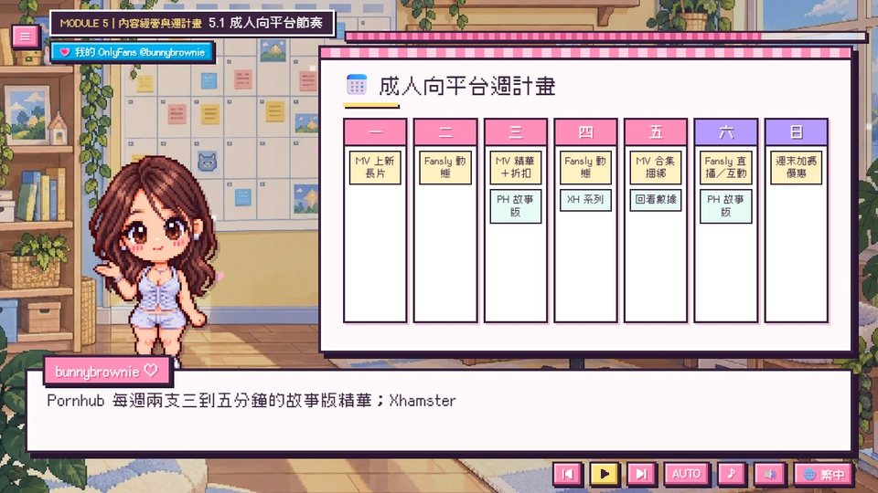</td>
</tr>
<tr>
<td align="center">真實數據，附來源出處</td>
<td align="center">分級定價：同樣 100 位粉絲，營收多出 56%</td>
<td align="center">一份你可以直接拿來用的每週計畫</td>
</tr>
<tr>
<td>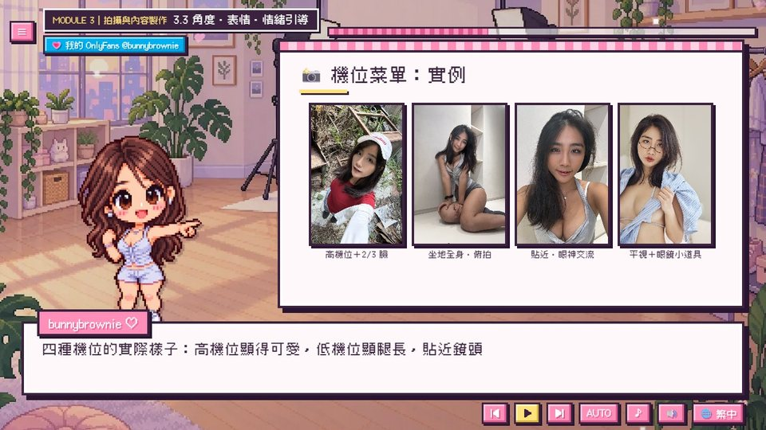</td>
<td>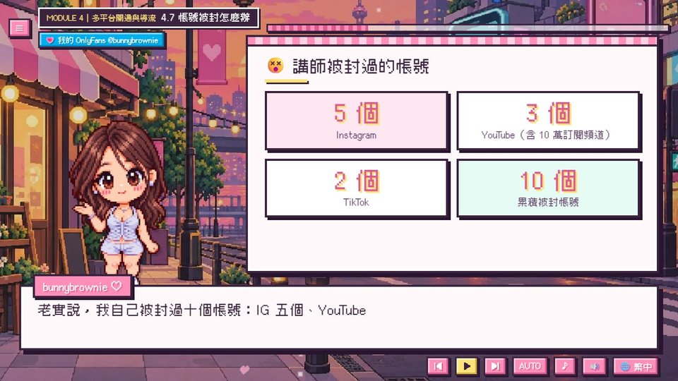</td>
<td>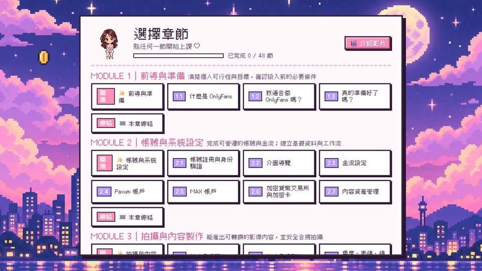</td>
</tr>
<tr>
<td align="center">附真實照片的拍攝角度選單</td>
<td align="center">我失去的那十個帳號——以及正確的心態</td>
<td align="center">附進度顯示的章節選單</td>
</tr>
</table>

---

## ✨ 課程特色

<table>
<tr>
<td width="62%" valign="top">

- 🎙️ **我的真實聲音**為每一句台詞配音（中文和英文），有情感，不是機器人語音。
- 🌏 **8 種語言**：字幕和白板內容全部翻譯完整，特定國家的內容只在相關地區才會出現。
- 📱 **手機、平板、電腦都支援**：直立拿手機時會自動切換成專屬的直向版面。
- ▶️ **接續上次進度**：標題畫面會提供「繼續」選項，直接回到你上次停下的那一句。
- ✅ **互動式檢查清單與計算器**，會記住你的答案。
- 📊 每個數據看板都附有**真實數據與出處來源**。
- ⚡ **輕量化**：第一次造訪只需要下載約 260 KB。
- 💸 **完全免費**，不用註冊。

</td>
<td width="38%" valign="top" align="center">
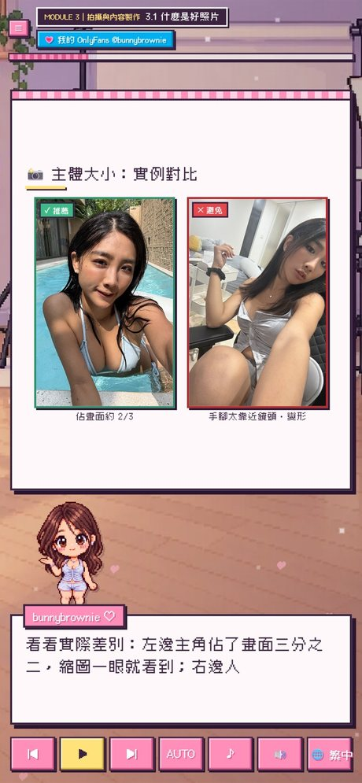
 手機直向版面
</td>
</tr>
</table>

---

## 🌏 8 種語言

| 語言 | 字幕 | 語音 |
|---|:-:|:-:|
| 繁體中文（含台灣專屬課程：文件辦理、本地交流、台灣法規） | ✅ | 中文 |
| 简体中文 | ✅ | 中文 |
| English | ✅ | 英文 |
| Español · Português · 日本語 · Deutsch · Français | ✅ | 英文 |

---

## 🔞 年齡確認

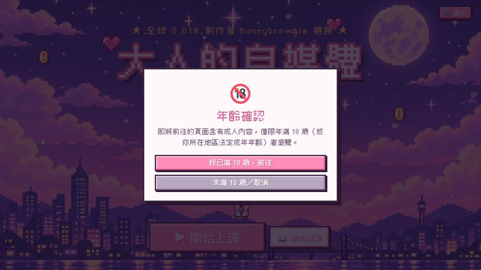

第一次進入課程時，系統會請你確認自己已滿 18 歲（只需要確認一次）。每個畫面裡連到我頁面的連結，在打開之前都會再問一次。

---

## ▶️ 怎麼觀看

- **線上觀看：** <https://bunnybrownie36.github.io/bunnybrownie-of-course/>
- **📱 手機／平板：** 用手機瀏覽器打開同一個連結——直立拿就是直向版面，橫放就會變成寬螢幕版面。
- **🎬 介紹影片：** 章節選單裡有一段我錄的簡短自我介紹影片。
- **離線觀看：** 下載這個 repository，用瀏覽器打開 `course/index.html` 即可。
- **鍵盤操作：** `Space` 播放／暫停，`←` `→` 上一句／下一句。

### 備註
- 這個課程只是一般性教學內容，**並不構成法律、稅務或財務建議**。平台規則常常會變動，請務必隨時查看最新條款。
- 語音：Fish Audio · 音樂：Google Lyria 3.5 · 插畫：GPT Image 2.5 · 示範照片：由創作者本人拍攝 · 字型：[Cubic 11](https://github.com/ACh-K/Cubic-11)、[Fusion Pixel Font](https://github.com/TakWolf/fusion-pixel-font)（SIL OFL 1.1）

**▶ [開始免費課程](https://bunnybrownie36.github.io/bunnybrownie-of-course/)**

